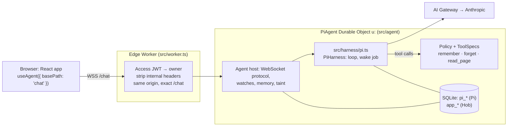

# Hob

Hob is a private assistant for one person, running on Cloudflare. You chat with it from your laptop or phone. It streams its answers, remembers facts you tell it, and reads web pages you point it at. [Pi Durable](https://github.com/earendil-works/pi/tree/main/packages/durable) runs the agent loop inside a Durable Object, so a crash or a deploy in the middle of an answer picks up where it stopped.

This is **v0** from [`docs/blueprint.md`](docs/blueprint.md) (section 3): a web chat with three tools, `remember`, `forget` and `read_page`. None of them changes anything outside Hob, so v0 needs no approval step. The build plan is in [`docs/superpowers/plans/2026-10-07-hob-v0.md`](docs/superpowers/plans/2026-10-07-hob-v0.md).

## Try it locally, without a Cloudflare account

```sh
pnpm install
pnpm demo
```

Open the URL Vite prints. The demo runs the real Worker, agent and web app on a scripted model instead of a real one, so it costs nothing. The scripted model answers:

| You type | Hob does |
| --- | --- |
| `remember coffee: Flat white, oat milk` | saves a memory (watch the Memory button) |
| `forget coffee` | deletes it |
| `read https://example.com/anything` | reads a fake page and marks the conversation as including web content |
| `follow` | tries to open a site you never named, as an injected instruction would, and is refused |
| `slow` | starts a tool that waits until you press Stop |
| anything else | echoes it back |

Needs Node 22.19 or later and pnpm (`corepack enable` gives you the pinned version).

## Deploy your own

You need a Cloudflare account on Workers Paid ($5/month) and a domain on Cloudflare, because Hob sits behind a hostname-based Access application.

1. **Choose a hostname**, for example `agent.example.com`. In [`wrangler.jsonc`](wrangler.jsonc), uncomment `routes` and put it there. `workers_dev` and `preview_urls` stay off, so the protected hostname is the only way in.

2. **Protect it with Cloudflare Access.** In Zero Trust, go to Access, then Applications, then add a self-hosted application for the whole hostname (no path), with a policy that allows only your email. Copy its **Application Audience (AUD) tag**. Use a hostname application, not Access enabled on the Worker itself: that mode returns 403 on WebSocket upgrades.

3. **Fill in `vars` in `wrangler.jsonc`:**

   | Var | Value |
   | --- | --- |
   | `TEAM_DOMAIN` | `https://<your-team>.cloudflareaccess.com` |
   | `OWNER_EMAIL` | the email Access lets in |
   | `OWNER_USER_ID` | an opaque id; make one with `node -e "console.log('usr_' + crypto.randomUUID())"`. It names your Durable Object, so set it once and never change it. |
   | `OWNER_TIMEZONE` | e.g. `Europe/London`, for the date Hob sees |
   | `MODEL_ID` | `anthropic/claude-opus-5-5` by default (see [Models](#models)) |
   | `AI_GATEWAY_ID` | the AI Gateway Hob's model calls go through, `hob` by default |

   After changing `wrangler.jsonc`, run `pnpm types` to refresh `src/worker-configuration.d.ts`.

4. **Set up AI Gateway.** Create a gateway with the id from `AI_GATEWAY_ID` and turn on Unified Billing with some credits, so Claude works without a provider key in the Worker. **Set a spend limit on the gateway.** It is v0's only guard against a runaway tool loop. Leave logging on: it is where you see the cost of each request. It also stores full prompts, so decide whether that is acceptable for you.

5. **Deploy, with the secret.** `ACCESS_AUD` is a required secret, and `wrangler secret put` can't set one on a Worker that doesn't exist yet, so the first deploy carries it in a file:

   ```sh
   pnpm exec wrangler login
   echo "ACCESS_AUD=<the AUD tag>" > .secrets.env   # gitignored
   pnpm build
   pnpm exec wrangler deploy --secrets-file .secrets.env
   rm .secrets.env
   ```

   After that, deploy with `pnpm run deploy`, and change the tag with `pnpm exec wrangler secret put ACCESS_AUD`. Without the tag, every request is refused. A deploy, and every `wrangler secret put`, restarts the Durable Object (see [Deploys](#deploys-and-crashes)).

6. Open `https://agent.example.com`, sign in through Access, and say hello. On a phone, "Add to Home Screen" gives you an app icon.

### Models

`MODEL_ID` is a model id from pi-ai's Cloudflare AI Gateway catalog, written `<provider>/<model>` with **hyphens, not dots**: `anthropic/claude-opus-5-5`, `anthropic/claude-sonnet-5`, `anthropic/claude-haiku-4-5`, `anthropic/claude-fable-5-1`. A Workers AI id such as `@cf/zai-org/glm-5.3-flash` works too, as a cheap fallback. Change it and redeploy; on its next start Hob moves the conversation to the new model. An id the catalog doesn't know is logged at startup, and the answer fails with that error in the UI.

Hob asks for thinking effort "low". On Opus 5.5, pi-ai turns that into adaptive thinking at low effort; Opus 5.5 can't have thinking switched off.

### Local development against real models

```sh
cp .dev.vars.example .dev.vars   # a placeholder ACCESS_AUD, the required secret
pnpm exec wrangler login
pnpm dev
```

The AI binding has no local simulation, so `pnpm dev` calls the real models and **spends real money**. Access isn't in front of localhost, so a development build lets requests through when the hostname is `localhost`, `127.0.0.1` or `[::1]`. The switch is Vite's `import.meta.env.DEV`, which `vite build` compiles to `false`: production has no bypass to turn on.

## Tests

```sh
pnpm check   # typecheck, tests, build
pnpm test    # just the tests
```

The tests run inside workerd with `@cloudflare/vitest-pool-workers`, against the real agent and the real Pi harness on pi-ai's faux model. They cover:

- the tools, including aborts, timeouts, oversized and binary pages, blocked hosts, redirects (every hop is checked), and hostile HTML that has to convert in linear time
- the store, the policy and the edge Worker: Access JWTs, header stripping, same-origin and path checks, and the taint rules
- the WebSocket protocol, memory surviving an eviction, a socket that hibernated with the object, and a new `MODEL_ID` taking over the conversation
- the run itself: tainting and the egress refusal, Stop, and a crash in the middle of a tool call that the harness recovers from
- the web app's reducers and outbox, including that a run followed live folds to the same view a late snapshot gives

`test/architecture.test.ts` fails if anything outside `src/harness/pi.ts` imports Pi, in any import form.

### In a browser

`test/e2e/browser-check.cjs` drives `pnpm demo` in Chromium from a clean state. It covers layout on a desktop and on a phone in dark mode, the memory drawer, Stop, and New topic. It also loses a message on a dead socket and checks that it's resent, checks the reload hint, and kills the demo server mid-tool, as a deploy would, to watch the answer resume. Playwright isn't a project dependency:

```sh
npm install -g playwright && npx playwright install chromium   # once
NODE_PATH="$(npm root -g)" node test/e2e/browser-check.cjs     # screenshots go to test-results/browser
```

## How it fits together



| Path | Responsibility |
| --- | --- |
| `src/worker.ts`, `src/auth/` | The stateless edge. It authenticates, strips headers the SDK would trust, and routes to the object whose name the server derives. `agentName()` is the only code that builds object names. |
| `src/agent/agent.ts` | `PiAgent extends Agent`. Wiring only: the WebSocket protocol, re-watching sockets after a restart, and pushing memory and taint changes. |
| `src/agent/store.ts` | Hob's own state in `app_memory`, `app_conversation`, `app_owner_host` and `app_meta` (the schema version and the last model applied), beside Pi's `pi_*` tables. |
| `src/agent/runtime.ts` | The harness port (`submit`, `wait`, `abort`, `reset`, events). |
| `src/harness/pi.ts` | **The only module that imports Pi.** It opens `PiHarness`, compiles `ToolSpec`s into Pi tools, and wires the model through `createAI` and AI Gateway. |
| `src/tools/` | Harness-neutral tools and the `Policy` every call goes through. |
| `src/shared/protocol.ts` | The browser ↔ agent protocol, `pi-events/1`. |
| `web/` | The app. `view.ts` folds Pi's events; the rest is the UI. |

The wire carries Pi's own `AgentEvent`s, an accepted v0 shortcut from the blueprint. The protocol is versioned, so a neutral event format can replace it when the harness changes.

### Deploys and crashes

Every deploy and every `wrangler secret put` restarts the Durable Object mid-answer. Pi commits every model request and tool call as a checkpointed task, and `PiHarness` keeps a wake job with a 30-second heartbeat while an answer is in progress. After a restart, the alarm reopens Pi and the answer continues from its last checkpoint. All v0 tools are safe to run again. The browser reconnects, and while the answer is catching up, the flame re-ignites and the status line says "Resuming the answer that was cut off…".

## Security model

- **One owner.** A hostname-based Access application sits in front of everything. The Worker checks the `Cf-Access-Jwt-Assertion` itself: RS256, issuer, audience, and the owner's email. It caches the key set at module scope. The Durable Object is named from an internal id, never from anything the client sends.
- **Nothing the SDK trusts gets through from a client.** The edge removes the `x-agents-*`, `x-cf-agents-*` and `x-partykit-*` header families, plus credentials. It forwards only the exact path `/chat`, because the SDK routes `/chat/sub/<class>/<name>` to child objects, and the object refuses that routing too. It refuses WebSocket handshakes from other origins. Connections are read-only for Agent state, Hob exposes no `@callable` methods, and SDK identity and state frames are off.
- **No outside effects in v0.** The policy refuses any tool marked as a side effect, and v0 has none.
- **Web pages are untrusted.** `read_page` output is wrapped in `<untrusted source="…">`, and the wrapper can't be closed from inside. Reading a page marks the conversation, and the status line shows "Includes web pages".
  - From then on, Hob only opens hosts you named in your own messages: exactly those hosts, not their subdomains. Every redirect is checked against the same rule. This stops a page from steering Hob into sending your memory somewhere else.
  - A memory saved in such a conversation is flagged for you to keep or delete. Until you do, it counts as web content too, even after New topic.
  - While web content is in play, Hob can add flagged memories, but it can't change or delete confirmed ones.
  - **New topic** clears the conversation's mark.
- **`read_page` limits.**
  - It reads http(s) only. It never reads IP addresses, localhost, internal names, or URLs with credentials.
  - It follows at most five redirects and checks each one.
  - It times out after 20 s and honours Stop.
  - It reads at most 2 MB. At most 45 KB and 1,950 lines of that reach the model, which keeps it inside Pi's 50 KB tool-result bound.
  - Its HTML converter runs in linear time, so a hostile page can't stall the agent.
- **The browser loads nothing a model chose.** Images in answers are never loaded and links open without a referrer. A Content-Security-Policy in `public/_headers` allows scripts and connections only to this origin.

Known gaps until v1's approvals:

- A malicious page can still try to send data to its own site through `read_page`, since you named that site.
- AI Gateway logs full prompts by default.
- Access is checked when a socket opens. If you revoke the session, an open socket keeps working until it next drops. An expired session fails every reconnect, and the status line then suggests reloading to sign in.
- Under `pnpm dev`, `read_page` fetches from your machine. It refuses IP addresses and local names, but not a public name that resolves to a private address.

## v0 exit criteria (blueprint, section 3)

| Criterion | Where it stands |
| --- | --- |
| 1. Used every day for a week | Yours to do. |
| 2. A deploy mid-turn recovers on its own, and the UI shows "resuming…" | Recovery is tested: `test/agent.test.ts` crashes the object mid-tool and the answer finishes. `test/e2e/browser-check.cjs` kills the demo server mid-tool and watches the UI go from "Connection lost" to "Resuming the answer that was cut off…". To check for real, run `pnpm run deploy` while Hob is answering. |
| 3. The transcript and memories survive eviction | Tested (`test/agent.test.ts`). |
| 4. Every tool honours `abortSignal` | Tested for `read_page` and for a blocking tool; Stop is in the UI. |
| 5. A 200+ turn conversation goes through compaction without running out of memory | Pi compacts by default, and the UI shows "Summarising older messages…". Needs real use: Cloudflare hasn't tested compaction on Durable Objects. See [Known limitations](#known-limitations). |
| 6. Cost per request is visible in AI Gateway | Every request goes through `AI_GATEWAY_ID` with metadata `{ app: "hob" }`. The status line also shows the conversation's spend from Pi's usage ledger. |
| 7. Exact pins, with overrides for their dependencies | `agents@0.26.0`, `@earendil-works/pi-durable@1.0.4` and `@earendil-works/pi-ai@1.0.4` are pinned, and `pnpm.overrides` pins `chord`, `pi-ai` and `pi-telemetry`. The lockfile is committed. |

## Checked against the real packages

The blueprint marked many claims as unverified. Building v0 against the pinned releases settled these:

- **Model ids use hyphens.** `anthropic/claude-opus-4.8` throws in `createAI`; the catalog id is `anthropic/claude-opus-4-8`. The default here is `anthropic/claude-opus-5-5`.
- **`Agent` hosts `PiHarness` as documented** with `this.lifecycle.use(this.harness)`. `getConnections()` and `shouldSendProtocolMessages()` exist (confidence notes 2 and 3).
- **`new Request(request, { headers })` keeps the WebSocket upgrade** when forwarded to the object (confidence note 4). The edge tests cover it.
- **There is a third internal header.** Besides `x-agents-lifecycle-props`, the SDK reads `x-cf-agents-subagent-url`, and `routeAgentRequest` forwards client-supplied props headers unchanged. The edge strips all three families.
- **Compaction is on by default** in pi-durable 1.0.4 (`DEFAULT_COMPACTION_POLICY.enabled`).
- **The package manager is pnpm.** npm 10 crashes resolving the `agents` peer set (`Cannot read properties of null (reading 'edgesOut')`), so the blueprint's "package-manager overrides" are `pnpm.overrides`.
- **`web_search` waits for the next `agents` release.** Its tool (`agents/websearch`, Cloudflare's Web Search API) exists only on the agents main branch.
- **`.dev.vars` and `secrets.required` don't mix.** Once a `secrets` block exists, wrangler 4.148 loads only the `.dev.vars` keys it declares, so the blueprint's `DEV_AUTH` variable would never reach `pnpm dev`. The bypass is gated on Vite's `import.meta.env.DEV` instead, which is just as absent from production. For the same reason, the first deploy of a new Worker has to carry the secret with `--secrets-file`.
- **Pi keeps only the first 50 KB or 2,000 lines of a tool result**, so `read_page` budgets its text in bytes and lines, with room left for its label.
- **HTMLRewriter didn't fit hostile pages.** It calls into JavaScript once per text chunk, so 2 MB of `<` took 13 s, and deep nesting hits its memory limit. `read_page` uses a single-pass scanner instead.

## Known limitations

- **Compaction and preserved thinking.** pi-ai 1.0.4 asks Anthropic to drop mismatched thinking blocks only for models flagged `supportsMidConvoEffort`, and no gateway model has that flag. With your own Anthropic key on an account created on or after 31 August 2026, a compacted conversation may get errors from the preserved-thinking check. Unified Billing uses Cloudflare's account; watch for it anyway during the 200-turn check.
- **One conversation.** "New topic" starts a fresh context in it. Pi cannot delete a conversation.
- `read_page` turns HTML into text with a small converter; v1 moves it to Browser Run.

## Next (v1 in the blueprint)

- Telegram with a reply outbox, and reminders with `this.schedule`
- Approve-then-host-executes for tools with side effects
- MCP integrations
- `web_search` once `agents/websearch` is released
- Custom tracing spans

Two newer platform features may simplify things later:

- wrangler's `durable_objects.code_update_strategy: { mode: "deferred" }` waits for objects to hibernate before applying a deploy. It is not documented yet, so it is not used here.
- `ctx.access.getIdentity()` gives Access identity without verifying the JWT yourself, but only for Access enabled on the Worker, which v0 avoids.

Pi is MIT licensed. The web app's reducer is adapted from Cloudflare's [Pi harness example](https://github.com/cloudflare/agents/tree/main/examples/next/harnesses/pi).
