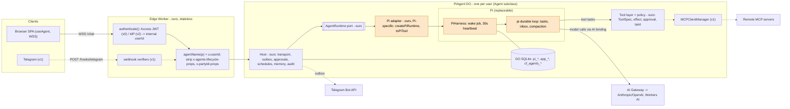
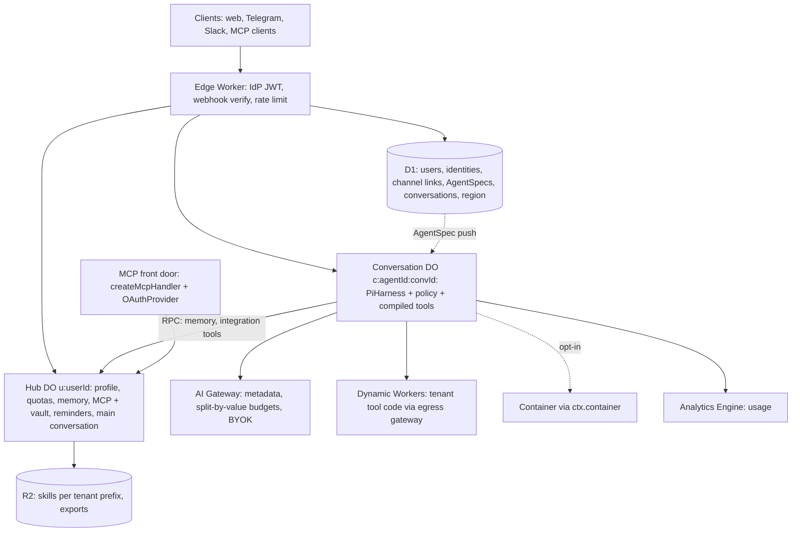

Contents

1. [00Verdict](#verdict)
2. [01Understanding](#s1)
3. [02Feasibility](#s2)
4. [03v0 scope](#s3)
5. [04Architecture](#s4)
6. [05Key flows](#s5)
7. [06Tools](#s6)
8. [07Auth](#s7)
9. [08Deploy & ops](#s8)
10. [09Roadmap](#s9)
11. [10Platform model](#s10)
12. [11Risks](#s11)
13. [12Your decisions](#s12)
14. [13Confidence](#s13)
15. [14Red-team](#s14)
16. [··Sources](#sources)

Architecture proposal · Draft for your review · 6 October 2026

# Pi Agent Blueprint

Your own AI agent on Cloudflare, with Pi Durable running the agent loop inside a Durable Object. This page assesses feasibility, defines the smallest useful first version, and lays out how it grows into a platform where other people build their own agents.

- **agents** 0.26.0 · 2 Oct
- **@earendil-works/pi-durable** 1.0.4 · 5 Oct
- **@earendil-works/pi-ai** 1.0.4
- **compatibility_date** 2026-10-06
- **241** sourced claims · **133** re-checked · **20** corrected

Your personal agent

Go now

v0 in a weekend to a week

Pi Durable's checkpointed loop and crash recovery already work on Durable Objects. In Cloudflare's chaos runs on a real account, out-of-memory kills, CPU kills, aborts and redeploys all recovered on the next 30-second heartbeat.[30](#src-30)

Platform for other users

Conditional go

3–6 months out

Feasible if your own code talks to Pi through a small interface you own from day one (`AgentRuntime` plus a portable `ToolSpec`), and you budget about a day for each Pi or agents SDK upgrade. Both packages are days-old releases and the API is still moving.

#### Pi Durable gives you

- A durable agent loop: every model request, tool call and compaction is a checkpointed task.[5](#src-5)[6](#src-6)
- Storage in the Durable Object's own SQLite, in tables prefixed `pi_`.[4](#src-4)
- A wake job with a 30-second heartbeat while a session has work, so an evicted or crashed object resumes from its last checkpoint.[4](#src-4)
- Inbox, steering, sessions, forking, compaction and retries.[5](#src-5)
- Model calls through AI Gateway, so your Worker holds no provider key.[15](#src-15)

#### You build around it

- Login, and server-side choice of which Durable Object a request reaches. The official example has neither.[3](#src-3)
- The client transport, adapted from the example.
- Approvals for risky tools. Pi has no approval step.[1](#src-1)
- A bridge from MCP tools to Pi tools.
- Channel adapters such as Telegram, with a reply outbox.
- Scheduling with Agent schedules instead of Pi timers.[23](#src-23)
- Deletion, metering and quotas.

≈ $5 / mo

Infrastructure for you alone (Workers Paid base; DO usage within included amounts)

$0.15–0.36

Infrastructure per user per month at 1,000 users

10–100×

How much more model tokens cost than infrastructure

Green works today Yellow works with effort or caveats Red missing; we build around it unverified no fetched source confirms it Pi Pi-specific code

## 01Understanding and assumptions

Please correct anything here that's wrong. Several later choices follow from these.

| You said | What I take it to mean |
| --- | --- |
| "my own personal agent" | One owner, private, reachable from laptop and phone. It remembers facts about you and reads the web. Later it pushes reminders and acts in your accounts. |
| "later expose it as a platform for other users to build their personal agents" | Multi-tenant. Each user gets an isolated agent they configure: prompt, model tier, integrations, skills, schedules. Running user-written code is a later, optional tier. |
| "infra Cloudflare, harness Pi Durable" | Workers, Durable Objects and AI Gateway, with `PiHarness` from `agents/harness/pi` running the loop. |
| "start small, then evolve" | Every later phase adds to v0. Nothing is rewritten and no data migrates. |
| "how tools integrate, how it gets deployed, how it authenticates" | Sections [6](#s6), [8](#s8) and [7](#s7). |

### Assumptions

A1

You are the only user until v2. No compliance regime at first.

A2

TypeScript on Workers Paid ($5/month). Paid-only Workers AI models, Dynamic Workers, Containers and the higher CPU limits all need it.[26](#src-26)[31](#src-31)

A3

A frontier model (Claude or GPT) through AI Gateway runs the main loop, and cheap models handle side tasks. Paid-only Workers AI models are capped at 20 requests per minute per account per model (50 with credits), which is too tight for the main loop.[31](#src-31)

A4

"Simplest use case" means a web chat that remembers facts about you and reads web pages, with **no tools that change anything outside the agent**. That lets v0 skip approvals.

A5

Telegram, reminders and integrations come in v1. A reminder is pointless without a push channel, so the two ship together.

A6

At first, platform users configure agents rather than deploy code.

A7

No single model stream runs longer than about 5 minutes. An alarm invocation can run for at most 15 minutes of wall time.[1](#src-1)[19](#src-19)

### Answers that would change the design

1. **Will platform users upload code?** Config only means one multi-tenant Worker with agents stored as data. Tool code means Dynamic Workers. Whole agents or apps means Workers for Platforms ([section 10](#s10)).
2. **How soon do you need tools with side effects** such as email, posting or payments? If immediately, approvals come before everything else. If approvals and client-side tools are central, reconsider Think, which has `needsApproval` and client tools built in.[35](#src-35) AiSdkHarness is merged on main but not released.[42](#src-42)
3. **Who pays for model tokens on the platform?** Your own keys stored in AI Gateway, plus metering, works today. Per-user keys cannot travel through `createAI`.[15](#src-15)[18](#src-18)
4. **Must users delete a single conversation, or only their whole account?** Pi cannot delete a conversation, so per-conversation deletion means one Durable Object per conversation.[1](#src-1)[22](#src-22)
5. **Which channel comes after Telegram?** Built-in email routing needs the `Agent` base class.[37](#src-37) Slack and WhatsApp need signature verifiers you write.
6. **Shared or team agents?** The Durable Object is the authorization boundary: whoever reaches it can reach everything inside it. Pi's Channels adapter also drops the sender's identity.[25](#src-25)
7. **Residency, retention, and whether prompts may be logged?** A Durable Object's jurisdiction is fixed when it's created.[19](#src-19) AI Gateway logs full payloads by default.[18](#src-18)
8. **Long jobs over about 10 minutes**, such as deep research or builds? Those move to Workflows or Containers.

## 02Feasibility verdict

| Concern | Rating | Why |
| --- | --- | --- |
| Harness maturity and API churn | Yellow | pi-durable 1.0.0 shipped 2026-10-01 and its README says "API changes without notice". One core author writes most of it.[5](#src-5)[7](#src-7) The import path `agents/harnesses/pi` was removed in 0.26.0, the day after it shipped.[7](#src-7) PiHarness, `agents/models/pi-ai` and `agents/lifecycle` are all beta or experimental. Cloudflare calls this a "first step" toward supporting third-party harnesses.[41](#src-41)[42](#src-42) |
| Durability and crash recovery | Green | Tasks are checkpointed and each tool declares whether it's safe to replay. In Cloudflare's chaos runs, every recovery came from the next 30 s heartbeat. Scenarios took 42–95 s end to end including redone work, and a 35-minute run completed (PR #2421, still open).[30](#src-30) |
| Long runs | Yellow | The harness hands off every 10 minutes because an alarm can run for at most 15. A single model stream longer than that can be cut, so set `stream.timeoutMs`.[1](#src-1)[4](#src-4) |
| Native tools | Green | A `ToolRegistration` is a name, a schema (plain JSON Schema is accepted), a replay policy, an execution mode and `execute`.[2](#src-2)[3](#src-3) |
| MCP and third-party tools | Yellow | Pi has no MCP support. The SDK's MCP client handles OAuth (dynamic client registration with PKCE) and stores tokens in the Durable Object. The bridge to Pi is about 60 lines of ours and calls `callTool`, which exists in source but is undocumented.[16](#src-16) |
| Human approval | Red made workable | Pi has no approval primitive, and the Channels Pi adapter rejects tool answers.[1](#src-1)[25](#src-25) A blocked call can't pause and resume in place, so we build approve-then-host-executes ([flow f](#flow-f)). |
| Client-side tools | Red | Pi rejects tool answers.[25](#src-25) Avoid them while Pi is the harness. |
| Sandboxed code | Green | JavaScript runs in Dynamic Workers with no network access. Linux Containers are generally available.[26](#src-26)[27](#src-27) |
| Your login → agent | Green personal Yellow platform | Cloudflare Access in front, plus a JWT check in the Worker. The server owns Durable Object naming (see `examples/auth-agent`). The client-supplied props header must be stripped.[9](#src-9)[10](#src-10)[11](#src-11)[12](#src-12) |
| Channel → agent | Green ours Yellow Cloudflare Channels | Webhook signature checks are standard. `agents/experimental/channels` exists only on main and is changing; the `agents/channels` export in 0.26.0 is slated for breaking removal.[25](#src-25) |
| Agent → third-party OAuth | Yellow | Tokens are isolated per Durable Object but not encrypted at the application level. `removeServer` doesn't revoke tokens at the provider.[16](#src-16) |
| Agent → models | Green personal Yellow platform Red per-user keys | No provider key lives in the Worker. Per-tenant attribution works only through `createAI`; options passed to `ai(id, opts)` never reach a Pi session. Limits: 20 gateways per account, and Unified Billing allows 200 requests per 60 s per gateway.[15](#src-15)[18](#src-18) |
| Deployment | Green Yellow | One `vite build && wrangler deploy`. But every deploy, and every secret rotation, restarts every Durable Object, and requests that touch storage stop immediately. Treat a deploy as a crash.[20](#src-20)[33](#src-33) |
| Channels | Yellow | You write the web and Telegram adapters. The Cloudflare Channels layer isn't on npm yet.[25](#src-25) |
| Multi-tenancy | Yellow | A Durable Object per user gives separate SQLite storage and an authorization boundary. But objects can share one 128 MB isolate, recovery is sealed after 3 out-of-memory strikes, and Pi can't delete a conversation.[8](#src-8)[19](#src-19) |
| Observability | Yellow | Pi isn't traced automatically. You add custom spans yourself.[39](#src-39) |
| Cost | Green infra Yellow models | See [section 8.8](#cost). |

**Overall: feasible.** The real work is approvals, deletion, the MCP bridge, auth wiring and keeping up with API churn. Each has a known workaround, described below.

## 03v0: the simplest use case

**A private assistant at `https://agent.<yourdomain>`.** You chat with it from laptop or phone, it streams its answers, it remembers facts you tell it, and it reads web pages you point it at.

| Aspect | v0 choice |
| --- | --- |
| Users | Just you, behind a **hostname-based** Cloudflare Access application. An Access policy set on the Worker itself returns 403 on WebSocket upgrades.[13](#src-13) |
| Surface | One web single-page app served from Worker assets. It talks over a WebSocket and is adapted from the example client (`view.ts`, `transcript.ts`, `protocol.ts`).[3](#src-3) |
| Conversation | One continuous conversation: Pi's root session `"1"` in your Durable Object. Compaction is on by default.[5](#src-5) |
| Model | One frontier model through AI Gateway with Unified Billing.[15](#src-15)[18](#src-18) `anthropic/claude-opus-4.8` is the id the docs show; a Sonnet or Haiku id must come from your gateway catalog unverified. Keep `@cf/zai-org/glm-5.3-flash` on Workers AI as a cheap fallback via `setModel`. |
| Cost guard | One AI Gateway spend limit as a dollar backstop against runaway tool loops.[18](#src-18) |

### Tools

All four are safe to replay and change nothing outside the agent.

| Tool | Behaviour | Effect → Pi `replay` |
| --- | --- | --- |
| `remember(key, text)` | Upserts a row in our `app_memory` table. A prompt section renders memory before every model request. | idempotent write → `safe` |
| `forget(key)` | Deletes the row. Deleting a missing key does nothing. | idempotent write → `safe` |
| `read_page(url)` | Plain `fetch` with `context.abortSignal`, converted to text and truncated (Pi's own limit is 50 KB or 2,000 lines).[5](#src-5) Output is labelled untrusted. | read → `safe` |
| `web_search(query)` v0.5 | Wraps a search-capable model or a search provider's API through AI Gateway. There's no first-party search tool, and the call shape is unverified.[47](#src-47) | read → `safe` |

#### Out of scope in v0

- Other users and sign-up
- Telegram and every channel besides the web app
- Reminders and schedules
- MCP and OAuth
- Any tool with outside effects, so no approvals needed
- `exec`, `@cloudflare/computer` (preview), Containers, subagents
- Multiple threads and file uploads
- Cloudflare Channels, Think and AiSdkHarness

#### v0 is done when

1. You've used it every day for a week.
2. A deploy in the middle of a turn recovers on its own, and the UI shows "resuming…".
3. The transcript and memories survive eviction.
4. Every tool honours `abortSignal`.
5. A 200+ turn conversation has gone through compaction without running out of memory.
6. Cost per request is visible in AI Gateway.
7. Package versions are pinned exactly, with overrides for their dependencies.

## 04Architecture

### Components

| Component | Owner | Single responsibility |
| --- | --- | --- |
| Edge Worker `src/worker.ts` | ours | Stateless. Serves assets, authenticates, verifies webhooks, strips untrusted headers, and routes to a Durable Object whose name **the server derives**. |
| Auth module `src/auth/` | ours | Turns a request into `Principal { userId }`, where `userId` is an internal opaque id, not the identity provider's subject. `agentName(p)` is the only function that builds Durable Object names. |
| Agent DO `PiAgent extends Agent` | ours, on the SDK | One per user. Wiring only: transport, outbox, approvals, schedules, memory, harness. |
| Harness adapter `src/harness/pi.ts` | Pi ours | The **only** importer of `@earendil-works/*`, `agents/harness/*` and `agents/models/*`. Exposes `AgentRuntime` and compiles `ToolSpec` into Pi tools. |
| Tool layer and policy `src/tools/` | ours | Portable `ToolSpec`s. One policy wrapper handles effect class, approval, taint, audit and credential lookup. |
| Channel adapters `src/channels/` | ours | Web protocol in v0, Telegram in v1, email and Slack in v2. Each verifies, normalizes, submits with the provider's event id as `operationId`, and delivers through the outbox. |
| PiHarness + pi-durable | Pi Pi + Cloudflare | Loop, checkpoints, inbox, steering, compaction, wake job, `pi_*` tables.[4](#src-4)[5](#src-5) |
| MCPClientManager v1 | Cloudflare SDK | MCP connections, OAuth, tokens stored in the Durable Object.[16](#src-16) |
| Storage | mixed | Durable Object SQLite holds `pi_*` (Pi), `app_*` (ours) and `cf_agents_*` (SDK). MCP tokens sit in Durable Object key-value storage. From v2: D1 as a directory, R2 for skills and exports, Analytics Engine for usage. |
| External | Cloudflare, third parties | AI Gateway (Anthropic, OpenAI, Workers AI), Browser Run, Dynamic Workers, MCP servers, Telegram Bot API. |

### Diagram: v0 solid, v1 additions dashed



### The harness boundary

Everything Pi-specific lives in one module. If Pi stalls or breaks, you swap the adapter, not the agent.

| Pi inside `src/harness/pi.ts` only | Ours: survives a harness swap | Cloudflare, harness-neutral |
| --- | --- | --- |
| `PiHarness`, `Harness.open`, registry, extensions, sections, settings | `AgentRuntime` (submit / wait / abort / reset) | `Agent`, Lifecycle, alarms, schedules |
| `ToolRegistration` compiler, `api.memo`, `api.output` | `ToolSpec` (JSON Schema, `execute`, effect class), policy, audit | Browser Run, Dynamic Workers, Containers, MCPClientManager |
| `AgentEvent` stream (in memory, no cursor) and its reducer | Wire protocol version tag (`"pi-events/1"` in v0) | WebSockets and hibernation |
| `pi_*` tables (transcript as EntryRecords) | `app_memory`, `app_outbox`, `app_approvals`, `app_reminders`, `app_audit`; transcript export via `harness.messages()` | Durable Object SQLite, D1, R2 |
| `createAI` / `createModels` wiring | Model choice and spend policy as config | AI Gateway |

1. Only `src/harness/pi.ts` imports Pi.
2. Tools use plain JSON Schema, which Pi's TypeBox validation accepts.[3](#src-3)
3. Memory, approvals, outbox, schedules and audit live in **our** tables, not in Pi documents. You lose Pi's fork semantics for that state and gain portability to AiSdkHarness or Think.
4. `AgentRuntime` copies the shape of Cloudflare's draft `AgentHarness` / `HarnessSession` interface (`submit` / `abort` / `wait` / `reset` / `watch`).[25](#src-25) Copy it; don't import it, because that file exists only on main.
5. **Accepted v0 shortcut:** the web wire still carries Pi's raw `AgentEvent`s so the example's `reduceView` can be reused. The protocol is versioned so a neutral event format can replace it later.

### Host class: an `Agent` subclass

The official example hosts Pi in a plain `DurableObject` with `Lifecycle.install(this).use(webSockets).use(harness)`.[3](#src-3) The Pi docs also document `PiHarness` inside an `Agent` with `this.lifecycle.use(this.harness)`.[1](#src-1) This design uses `Agent`, for these reasons:

| Need | `Agent` (published, documented) | Plain DO + Lifecycle |
| --- | --- | --- |
| Server-owned routing | `getAgentByName`[9](#src-9) initializes the object before RPC, so no manual `lifecycle.start()`. | `env.X.getByName()`, and every RPC method must `await this.lifecycle.start()`.[8](#src-8) |
| Reminders and cron | `this.schedule(Date \| seconds \| cron, "method", payload, {idempotent, retry})`[23](#src-23) | Lifecycle `jobs.push` + host `onJob`; the exact context and payload shape are unverified. |
| MCP OAuth | `addMcpServer(...)` returns `authUrl`; `callbackPath`; `configureOAuthCallback`[16](#src-16) | MCPClientManager as a capability is documented on main only; connect method names unconfirmed.[16](#src-16) |
| Email | `routeAgentEmail` → `_onEmail`, which exists only on `Agent`[37](#src-37) | Channels `handleEmail`, experimental, main only[25](#src-25) |
| Chat SDK messengers | `agents/chat-sdk` needs an `Agent`[24](#src-24) | n/a |

The cost: port the example's `sockets.ts` (about 250 lines) to `onConnect` / `onMessage` / `onClose`, and suppress Agent protocol frames (`shouldSendProtocolMessages`).[9](#src-9) Because of the adapter boundary, switching to a plain DO later is a code change only; the `pi_*` and `app_*` tables stay where they are. Cloudflare's own starter is moving to the plain DO (#2474), so revisit this at v2.[42](#src-42)

## 05Key flows

### (a) Web message over WebSocket, streamed answer v0

```mermaid
sequenceDiagram
  participant C as Browser
  participant E as Edge Worker
  participant D as PiAgent DO
  participant P as PiHarness/Pi
  participant G as AI Gateway
  C->>E: WSS /chat?session=1 (Access cookie)
  E->>E: verify Cf-Access-Jwt-Assertion; strip props headers
  E->>D: getAgentByName(PiAgent, "u:"+userId).fetch(clean)
  D->>P: session("1").events()  (watch)
  D-->>C: events[snapshot]
  C->>D: {type:"submit", input, operationId}
  D->>P: runtime.submit(input, {operationId})
  P->>P: wake job pi-wake:1 (30s heartbeat)
  P->>G: stream via AI binding (metadata attached)
  G-->>P: deltas
  P-->>D: AgentEvent batches
  D-->>C: events[message_update ...]
  P-->>D: run_end
  Note over D: idle -> wake job completes; sockets hibernate; no duration billing
```

1. The browser loads the app with an Access cookie already set; the hostname Access application covers it.[13](#src-13)
2. The client connects with `useAgent({ agent: "PiAgent", basePath: "chat", query: { session: "1" } })`. **The browser never picks a Durable Object name.**[11](#src-11)
3. The Worker verifies `Cf-Access-Jwt-Assertion` with `jose` against `https://<team>.cloudflareaccess.com/cdn-cgi/access/certs`, checking issuer and audience (keys rotate every 6 weeks, so match on `kid`).[12](#src-12) It maps the owner's email to the internal user id, **deletes `x-agents-lifecycle-props` and `x-partykit-props`** (the DO lifecycle decodes any copy it receives, and `getAgentByName(...).fetch(request)` forwards it unchanged),[10](#src-10) then forwards to `getAgentByName(env.PiAgent, "u:" + id)`.
4. `onConnect` stores `{ session }` in connection state, starts a Pi event watch, and sends a snapshot as the first batch.[3](#src-3)
5. On `submit`, the DO calls `runtime.submit(input, { operationId, whenBusy })`. It returns once the message is admitted; resending the same `operationId` returns `accepted: false`. `whenBusy` is `"followUp"` (default) or `"steer"`.[4](#src-4)
6. PiHarness pushes its wake job and runs the turn inside alarm invocations. Model calls go `createAI` → AI binding → AI Gateway. Partial output is committed every 250 ms (our setting; the default is 100 ms).[5](#src-5)
7. Event batches (`message_update`, `tool_execution_*`, `run_end`) fan out to watchers. Extend the example reducer, which ignores `usage_changed` and `compaction_start/end`.[3](#src-3)
8. When the turn is idle, the wake job completes. Hibernating WebSockets cost nothing while idle.[48](#src-48)
9. **Reconnect.** Watches live in memory and events have no resume cursor; a client more than 100 batches behind gets a fresh snapshot.[5](#src-5) After a reconnect or eviction the client **replaces** its state from a new snapshot, `onStart` re-watches each live connection, and `onClose` must unwatch or watches leak (copy `#unwatch` from the example).[3](#src-3)

### (b) Telegram webhook message v1

1. **Setup.** Call `setWebhook(url=https://agent.<domain>/hooks/telegram, secret_token=…)` (1–256 characters). Add an Access bypass rule that matches `/hooks/*` exactly.[24](#src-24)
2. The Worker compares `X-Telegram-Bot-Api-Secret-Token` in constant time, parses the update, and takes identity **only from the verified payload**: in v1 an allowlist of your `from.id`; in v2 a D1 link table `(telegram, bot, from.id) → userId` created with a one-time `?start=<nonce>`.[24](#src-24) Unknown senders get a silent 200.
3. The Worker calls RPC `receive({ channel: "telegram", target: chatId, text, eventId: "tg:" + update_id })` on your agent and returns 200 straight away, since Telegram retries slow webhooks.
4. `receive()` inserts an outbox row with `INSERT OR IGNORE`, calls `runtime.submit("[via telegram] " + text, { operationId: eventId })` (a Telegram retry gets `accepted: false`), and schedules `deliverReply` in 3 seconds.[23](#src-23)
5. Delivery is a **durable poll**, not `ctx.waitUntil`. Since compatibility date 2026-10-01, a pending `waitUntil` keeps the object alive and billed for up to 15 minutes, and it's lost on eviction.[32](#src-32) `deliverReply` calls `runtime.wait(op, { signal: AbortSignal.timeout(2_000) })` unverified; if the answer isn't ready it reschedules itself in 10 s; when ready it calls Telegram `sendMessage` and marks the row sent. Delivery is at-least-once.
6. Telegram and web share the root conversation, so there's one history across devices.[25](#src-25)

### (c) Scheduled or proactive task v1

1. You say "every weekday at 08:00 send me a digest of my reminders". The model calls `schedule_task({ cron, name, prompt })`, an idempotent write that upserts `app_reminders` keyed by an idempotency key held in `api.memo`,[5](#src-5) then calls `this.schedule("0 8 * * 1-5", "runScheduled", { id })`. Cron schedules dedupe by default.[23](#src-23) Assume cron runs in UTC unverified and convert from the stored user time zone.
2. **Never use `runtime.sleep` or background Pi tasks as timers.** Pi's timers live in memory, background tasks are polled every 30 s (billed), and since 2026-10-01 a pending timer keeps the object alive and billed for up to 15 minutes.[3](#src-3)[4](#src-4)[32](#src-32)
3. When the schedule fires, `runScheduled({ id })` skips cancelled reminders, sets `op = "sched:" + id + ":" + dueMinute` to dedupe retries, inserts an outbox row for Telegram, submits `"[automated trigger, not a message from the owner] Scheduled task …"`, and schedules `deliverReply`.
4. The automated-trigger label matters for the taint policy ([6.3](#policy)): triggered text is never treated as you speaking.

### (d) Tool call that needs your third-party OAuth token v1 · MCP

#### Connect, once per integration

1. The UI sends "connect github". The DO calls `this.addMcpServer("github", url, { id: "github", callbackPath: "mcp-oauth-callback" })`, which returns `{ state: "authenticating", authUrl }`.[16](#src-16) `callbackPath` is required because `sendIdentityOnConnect: false` hides instance names; it also keeps user ids out of URLs.
2. The browser goes to `authUrl`. The SDK's OAuth provider performs dynamic client registration with PKCE; the state nonce expires after 10 minutes.[16](#src-16)
3. The provider redirects to `/mcp-oauth-callback?code=…&state=…`. The Worker authenticates the request (the Access cookie is present), strips the props headers, and forwards it to **your** DO, where the SDK matches it by `state`.
4. Tokens are stored in the DO under `/{instance}/{serverId}/{clientId}/token`: isolated per user, but not encrypted at the application level (v2 adds a custom encrypting provider).[16](#src-16)
5. `onServerStateChanged` triggers a debounced reinstall of the `mcp` extension with stable tool names. Pi resolves tools from the live registry on every request, so existing conversations see new tools; a call in flight against a replaced extension returns `tool_unavailable`.[5](#src-5)

#### Call

1. The model calls `mcp_github_create_issue`. The policy wrapper treats any tool without `readOnlyHint` as a side effect, so this goes to approval ([flow f](#flow-f)).
2. Read-only MCP tools run directly: `await this.mcp.waitForConnections({ timeout: 10_000 })` (connections restore asynchronously after a wake), then `this.mcp.callTool({ serverId, name, arguments })`, which exists in source but isn't documented options unverified.[16](#src-16)
3. **The token never enters the model's context.** The MCP client attaches it.

#### Disconnect, and non-MCP OAuth

- Remove the server **and** call the provider's revoke endpoint yourself; `removeServer` doesn't revoke.[16](#src-16)
- For direct OAuth (Google, say), refresh tokens live in `app_vault`, envelope-encrypted with a per-user key wrapped by a master key from a Worker secret or Secrets Store. Secrets Store allows 100 secrets per account, so it can't hold per-user tokens.[18](#src-18)

### (e) Crash, eviction or deploy mid-run

| Moment | What happens |
| --- | --- |
| Before | Every model request and tool call is a committed task. Partial output is committed every 250 ms. Wake job `pi-wake:<session>` with a 30 s heartbeat.[4](#src-4)[5](#src-5) |
| Idle eviction | The object hibernates after about 70–140 s idle.[48](#src-48) Nothing is lost or billed; the next request or alarm reopens Pi. |
| Deploy, `wrangler secret put`, OOM, CPU kill, runtime restart | The isolate dies. The Pi docs say 30 s of grace; the Durable Object lifecycle docs say storage-touching requests stop **immediately** on a code deploy. **Treat every one as a hard crash.**[1](#src-1)[20](#src-20)[33](#src-33) WebSockets close. |
| Next start (≤ \~30 s) | PiHarness startup runs `pi.inspect()` and wakes each session with live tasks, or the next heartbeat or the Lifecycle deadman alarm does.[4](#src-4)[8](#src-8) |
| Resume | The generation retries from its checkpoint (tokens already spent count again). `replay: "safe"` tools rerun with stored arguments and `beforeTool` isn't rerun. Other tools return **interrupted** and the model decides what to do.[5](#src-5) |
| Our host | `onStart` re-watches sockets. Scheduled `deliverReply` and approval jobs resume through the Agent scheduler. Approval rows stuck in `executing` become `unknown` and you're notified. Side effects never re-run automatically. |
| Clients | `useAgent` reconnects and gets a new snapshot. Show "resuming" until `run_start` or `run_end`. |

- Keep `stream.timeoutMs` at 5 minutes or less. A stream over 15 minutes can be cut, and one that starts late in an alarm invocation may be cut earlier unverified.[1](#src-1)
- Lifecycle **seals recovery after 3 consecutive out-of-memory strikes**.[8](#src-8) Alert on it. Alarm handlers retry at most 6 times.[19](#src-19)
- `abort()` waits until idle with no grace period, so a tool that ignores `abortSignal` hangs Stop.[3](#src-3)

### (f) Risky tool that needs your approval v1 · approve, then the host executes

Pi has no approval primitive.[1](#src-1) Asking the model to re-issue the call after approval relies on it reproducing identical arguments and leaves a window for injected instructions. Instead, the call is **parked** and the host **executes exactly the approved arguments**, which is Cloudflare's suggested durable-pause pattern.[43](#src-43)

1. The model calls `send_email({to, subject, body})`. Its effect is `side-effect`, so `replay: "unsafe"` and sequential.
2. The compiled `execute` (never a Pi guard extension, which a conversation could deselect[5](#src-5)) computes `digest = sha256(conversation | tool | canonicalJSON(args))`, inserts a pending `app_approvals` row with an expiry, notifies you on the web socket and in Telegram with approve/deny buttons, and returns an error result: *"APPROVAL_REQUIRED \<id>: queued. It runs only if the owner approves; the outcome arrives as a new message. Do not call this tool again."* The run ends normally and nothing waits in memory, so the object hibernates.
3. You approve over the web, or through a Telegram `callback_query` verified like any webhook with `from.id` checked.
4. The DO atomically moves the row `pending → approved` (unexpired only), then `this.schedule(new Date(), "executeApproved", { id })`.[23](#src-23)
5. `executeApproved` moves the row to `executing`, runs the **same `ToolSpec.execute`** with the stored args and `idempotencyKey = "approval:" + id`, records the result in `app_approvals` and `app_audit`, then submits `"[system] Approved action <id> finished: …"` with `operationId: "approval:" + id`.
6. Denial or expiry submits `"[system] Action <id> was denied"`. A crash during `executing` leaves the row `unknown`; you're notified and nothing re-runs.

#### Alternatives

- Await inside `beforeTool` and store the decision with `api.memo`, which is Earendil's own pattern.[6](#src-6) Use it only for confirmations measured in seconds to minutes, because it keeps alarm invocations running in billed slices of up to 10 minutes.[4](#src-4)
- Workflows `waitForApproval()` for waits of days.[43](#src-43)
- Code Mode connectors with `requiresApproval` for large MCP catalogs.[38](#src-38)
- Don't use `control.terminate` to park: it ends the run only when **every** result in the round requests it.[5](#src-5)

## 06Tool integration model

Every tool is written once as a harness-neutral `ToolSpec` and compiled into a Pi `ToolRegistration` through a single policy wrapper. The tiers differ in where the code runs and how it gets credentials.

| Tier | What | How it's registered | Replay | Credentials | Phase |
| --- | --- | --- | --- | --- | --- |
| T0 Native | memory, `read_page`, `web_search`, reminders, `send_email` | `ToolSpec` → `toPiTool()` → `registry.install({ name: "core", sections, tools })` in the PiHarness factory. Keep extension names stable across deploys: pending tasks of an uninstalled extension stall.[5](#src-5) | by effect class | Worker secrets or `app_vault`; never in prompts, outputs or logs | v0 |
| T1 MCP bridge | Remote MCP servers you connect | `this.mcp.listTools({ state: "ready" })` → `ToolSpec`s → extension `"mcp"`, reinstalled on `onServerStateChanged` (debounced).[16](#src-16) | `safe` only if `readOnlyHint`; otherwise side effect + approval | OAuth tokens in your DO, attached by the MCP client | v1 |
| T1b Code Mode | Large or side-effecting MCP catalogs | One `codemode` tool calling `runtime.execute({ code })` with `McpConnector` and `requiresApproval` per method (experimental).[38](#src-38) | `unsafe` | Connector holds them | v2+ |
| T2a Dynamic Workers | Model-written JavaScript (`exec`); tenant tool code in v3 | `env.LOADER.get(stableId, …)` with `globalOutbound: null` or an egress gateway with `props`, and `limits: { cpuMs, subRequests }`.[26](#src-26) | `unsafe`, sequential | Added at egress; the sandbox never holds tokens | v1 optional, v3 |
| T2b Containers | Real shell, git, Python | `ctx.container.start/exec` on the agent's own class, or a custom Pi `ExecutionEnv` so Pi's read/write/edit/bash work.[5](#src-5)[27](#src-27) | `unsafe`, sequential | `enableInternet: false` + `interceptOutboundHttps` (128 entries, so ≤ 64 hostnames)[27](#src-27) | v2+, opt-in |
| T3 Human and client | Approvals; browser tools | Approvals per [flow f](#flow-f). Avoid client tools: Pi rejects tool answers.[25](#src-25) | n/a | n/a | v1 |
| Skills | `SKILL.md` plus resources | `skills(sources)` from `agents/harness/pi` adds `activate_skill` and `read_skill_resource`. Sources: bundled, `fromManifest`, `r2(bucket, { prefix })`, resolved once per process. Skill scripts don't run.[2](#src-2) | `safe` | R2, read-only, prefix per tenant | v1, v3 |
| Outbound: your agent as an MCP server | Let Claude or ChatGPT call your agent | Stateless `createMcpHandler` (McpAgent is deprecated) inside `@cloudflare/workers-oauth-provider`. Tools `submit_task` / `get_result` call into your DO, because runs outlast the 60 s MCP request default.[17](#src-17) | n/a | Library stores token hashes and encrypts props. `requiredScopes` isn't enforced, so check `ctx.auth.scope`; set `corsOptions` and `allowedHostnames`.[17](#src-17) | v2 |

### Replay and idempotency

| `safe`: reruns after a crash | `unsafe`: model receives "interrupted" |
| --- | --- |
| Reads, searches, `read_page`, workspace `read` / `ls` / `grep` | `edit`, `exec`, container commands |
| Upserts keyed by an `api.memo` value | `send_email`, posts, MCP writes, payments |
| Whole-file writes; deletes that tolerate a missing target | Anything without a provider idempotency key |

- **An interrupted unsafe tool plus a model retry is a new call with a new id**, so per-call idempotency keys don't stop the duplicate. All side effects go through approve-then-host-executes keyed by approval id, and side-effect `execute` writes an `app_audit` intent row before calling the provider. A later call with the same digest reports "possibly already sent at T; ask the owner" instead of sending again.
- Pi runs a round's tool calls in parallel by default; one `executionMode: "sequential"` tool makes the whole round sequential. Use it for shared-state tools (the example hit a git clone/log race).[3](#src-3)
- Every `execute` passes `context.abortSignal` to `fetch` or `callTool`.
- At most 10 Dynamic Workers can be in flight per object. `load()` bills a new Dynamic Worker on every call; use `get(stableId)`.[26](#src-26)
- **Every** registration goes through `toPiTool()`, including the MCP bridge and skills wrappers. A test asserts that `registry.install` only receives compiled tools.

### Policy: prompt injection, taint and exfiltration

- **The lethal trifecta arrives in v1.** The agent holds private data (memory, MCP data), reads untrusted content (web pages, email, MCP results) and has ways to send data out. `read_page` itself is one: a URL can carry secrets in its query string.
- **Taint.** Any read tool that returns third-party content sets a `tainted` flag on the conversation, which persists until `reset(handoff)` or compaction because injected text stays in context. While tainted, every side effect needs approval even if you allowlisted it, and `read_page` to a host that doesn't appear in your own messages needs approval or is fetched without a query string.
- **Memory poisoning.** `remember` writes from a tainted run are shown to you as notifications, and the memory section is editable in the UI.
- **Labelling.** Untrusted output is wrapped as `<untrusted source=…>…</untrusted>`. Automated triggers are labelled as not from you.
- **Runaway cost.** v0 uses a gateway spend limit. v1 adds a per-run cap on tool rounds, counted in the policy wrapper. Pi has no documented `maxTurns`.

### Code: portable spec and the Pi adapter

src/tools/spec.ts

```
// src/tools/spec.ts: ours, harness-neutral
export type Effect = "read" | "idempotent-write" | "side-effect";
export interface ToolCtx { signal: AbortSignal; idempotencyKey: string; output(chunk: string): void }
export interface ToolOutput { content: Array<{ type: "text"; text: string }>; isError?: boolean; untrusted?: boolean }
export interface ToolSpec<A = any> {
  name: string;
  description: string;
  inputSchema: Record<string, unknown>;   // plain JSON Schema
  effect: Effect;                         // drives replay, ordering, approval
  sequential?: boolean;                   // shares state (browser tab, sandbox, git)
  execute(args: A, ctx: ToolCtx): Promise<ToolOutput>;
}
```

src/harness/pi.ts

```
// src/harness/pi.ts: the ONLY file importing Pi / agents/harness / agents/models
import { createModels } from "@earendil-works/pi-ai/models";
import { createRegistry, Harness, type ToolRegistration } from "@earendil-works/pi-durable";
import { PiHarness } from "agents/harness/pi";
import { createAI } from "agents/models/pi-ai";
import type { AgentRuntime } from "../agent/runtime";
import type { ToolSpec } from "../tools/spec";
import type { Policy } from "../tools/policy";

export function toPiTool(spec: ToolSpec, policy: Policy): ToolRegistration {
  return {
    name: spec.name,
    description: spec.description,
    parameters: spec.inputSchema as never,                 // TypeBox accepts plain JSON Schema [3]
    replay: spec.effect === "side-effect" ? "unsafe" : "safe",
    executionMode: spec.effect === "side-effect" || spec.sequential ? "sequential" : "parallel",
    async execute(args, api, context) {
      const gate = await policy.gate(spec, args, api.conversationId);  // approval/taint/caps/audit; cannot be deselected
      if (!gate.ok) return { content: [{ type: "text", text: gate.message }], isError: true };
      const idempotencyKey = await api.memo("idem", crypto.randomUUID(), context); // stable across crash replays [5]
      const out = await spec.execute(args as never, {
        signal: context.abortSignal, idempotencyKey, output: (s) => api.output(s),
      });
      if (out.untrusted) policy.taint(api.conversationId);
      return { content: out.content, isError: out.isError === true };
    },
  };
}

export function createPiRuntime(o: {
  env: Env; modelId: string; metadata: () => Record<string, string>;
  tools: () => ToolSpec[]; sections: Array<{ key: string; render: () => string | Promise<string>; tag?: boolean }>;
  policy: Policy;
}) {
  const registry = createRegistry();
  const base = createAI({ binding: o.env.AI });            // defaults use only provider + id [4]
  const harness = new PiHarness({
    harness: ({ storage, context }) => {
      // Per-tenant gateway options MUST live on createAI; ai(id, opts) options never reach a session [15].
      const ai = createAI({ binding: o.env.AI, id: "personal", metadata: o.metadata() }); // max 5 entries [18]
      registry.install({ name: "core", sections: o.sections, tools: o.tools().map((t) => toPiTool(t, o.policy)) });
      const models = createModels();
      models.setProvider(ai.provider);                     // (unverified) mixing base/default with this provider
      return Harness.open(storage, {
        models, registry,
        settings: {
          retry: { enabled: true, maxRetries: 5, baseDelayMs: 1000 },
          stream: { timeoutMs: 5 * 60_000 },
          progress: { partialIntervalMs: 250, outputIntervalMs: 250 },
        },
        onReport: (e) => console.warn("pi report", e),
      }, context);
    },
    defaults: { model: base(o.modelId), thinkingLevel: "low" },
  });
  const s = (c?: string) => c ?? "1";
  const runtime: AgentRuntime = {
    submit: (input, x) => harness.submit(input, { session: s(x.conversation), operationId: x.operationId, whenBusy: x.whenBusy }),
    wait: (op, x) => harness.wait(op, { session: s(x?.conversation), signal: x?.signal }),
    abort: (x) => harness.abort({ session: s(x?.conversation), operationId: x?.operationId }),
    reset: (x) => harness.session(s(x?.conversation)).reset(x?.handoff),
  };
  return { capability: harness, runtime, registry, events: (session: string) => harness.session(session).events() };
}
```

src/tools/mcp.ts · v1

```
// src/tools/mcp.ts (v1): MCP -> ToolSpec, then compiled like any other tool
export function mcpToolSpecs(mcp: any /* MCPClientManager */): ToolSpec[] {
  return mcp.listTools({ state: "ready" }).map((t: any) => ({
    name: `mcp_${t.serverId}_${t.name}`.replace(/[^a-zA-Z0-9_-]/g, "_").slice(0, 64), // (unverified) provider name limits
    description: t.description ?? t.name,
    inputSchema: t.inputSchema ?? { type: "object", properties: {} },               // $ref/$defs untested under TypeBox
    effect: t.annotations?.readOnlyHint === true ? "read" : "side-effect",
    sequential: true,
    async execute(args: Record<string, unknown>, ctx: ToolCtx) {
      await mcp.waitForConnections({ timeout: 10_000 });
      const res = await mcp.callTool({ serverId: t.serverId, name: t.name, arguments: args },
                                     { signal: ctx.signal });   // in source, undocumented; options shape (unverified)
      const content = (res.content ?? []).map((c: any) =>
        ({ type: "text" as const, text: c.type === "text" ? c.text : JSON.stringify(c) }));
      return { content, isError: res.isError === true, untrusted: true };
    },
  }));
}
```

## 07Auth model: four layers

| Layer | Personal (v0–v1) | Platform (v2–v3) |
| --- | --- | --- |
| L1 You → agent | **Hostname**-based Access application (a policy on the Worker returns 403 on WebSockets).[13](#src-13) The Worker verifies `Cf-Access-Jwt-Assertion` (issuer, audience, owner email) with a module-level cached JWKS.[12](#src-12) Owner email → internal `userId` → `u:<userId>`. Strip props headers. `sendIdentityOnConnect: false`.[9](#src-9) | Identity provider (Clerk, WorkOS or Auth0 via JWKS, or Better Auth on D1) verified in the Worker. HttpOnly same-origin cookie for the web; short-lived tokens via `useAgent({ query: async () => ({ token }) })` for mobile, CLI and cross-origin clients, since browsers can't set WebSocket headers.[14](#src-14) The server always derives the object name. Explicit CORS, never `cors: true`. `routeAgentRequest`'s `prefix` is a URL path prefix, not a tenant namespace.[9](#src-9) |
| L2 Channel → agent | Telegram secret-token header compared in constant time, plus a `from.id` allowlist. Access bypass on exactly `/hooks/*`. `operationId = "tg:" + update_id`.[24](#src-24) | Verify the **raw body** before parsing:[24](#src-24) Slack v0 HMAC with 5-minute skew; Meta `X-Hub-Signature-256`; Discord Ed25519; email via `createSecureReplyEmailResolver` plus DMARC (Agent only).[37](#src-37) Identity only from the verified payload, through a D1 link table with one-time nonces. If ChannelGateway ships on npm, it becomes the trust boundary.[25](#src-25) |
| L3 Agent → tools | MCP OAuth tokens in the object, with platform encryption at rest only. Fixed callback path. A few platform keys as Worker secrets. No credential in prompts, outputs or logs. Policy lives in compiled `execute`. | Envelope-encrypted `app_vault` with the master key in Secrets Store. A custom `createMcpOAuthProvider` that encrypts MCP tokens.[16](#src-16) Revoke at the provider on disconnect. No static MCP `transport.headers` (stored as plaintext).[16](#src-16) Sandboxes get credentials only through egress gateways.[26](#src-26)[27](#src-27) Workers for Platforms outbound Workers **can't** see fetches made from Durable Objects, so egress allowlists live in tool code.[28](#src-28) |
| L4 Agent → models | AI binding (pre-authenticated) → AI Gateway with Unified Billing. One spend limit. Constant metadata `{ app: "personal-agent" }`. | Platform-owned provider keys in AI Gateway (BYOK) with "Require provider credentials", which removes the 5% fee and the 200 requests/60 s Unified Billing cap.[18](#src-18) Per-object `createAI` metadata `{ tenant_id, user_id, agent_id, plan }`. Spend limits split by `user_id` (≤ 20 rules per gateway, eventually consistent) plus an authoritative quota counter checked before `submit`. No gateway per tenant (≤ 20 per account). Per-user keys deferred.[18](#src-18) |

**Rules for every phase.** Never authorize from props. Always strip `x-agents-lifecycle-props` and `x-partykit-props`.[10](#src-10) The object name the server chose is the identity.

src/worker.ts · v0 + v1 Telegram

```
// src/worker.ts (v0 + v1 Telegram)
import { getAgentByName } from "agents";
import { createRemoteJWKSet, jwtVerify } from "jose";
export { PiAgent } from "./agent/agent";

const STRIP = ["x-agents-lifecycle-props", "x-partykit-props"];
let JWKS: ReturnType<typeof createRemoteJWKSet> | undefined;
export const agentName = (p: { userId: string }) => `u:${p.userId}`;   // the ONLY naming function

async function authenticate(req: Request, env: Env): Promise<{ userId: string } | null> {
  const token = req.headers.get("cf-access-jwt-assertion");
  if (!token) return null;
  JWKS ??= createRemoteJWKSet(new URL(`${env.TEAM_DOMAIN}/cdn-cgi/access/certs`));
  try {
    const { payload } = await jwtVerify(token, JWKS, { issuer: env.TEAM_DOMAIN, audience: env.ACCESS_AUD });
    return payload.email === env.OWNER_EMAIL ? { userId: env.OWNER_USER_ID } : null;  // internal id, not IdP sub
  } catch { return null; }
}

function safeEqual(a: string, b: string) {
  if (a.length !== b.length) return false;
  let d = 0; for (let i = 0; i < a.length; i++) d |= a.charCodeAt(i) ^ b.charCodeAt(i);
  return d === 0;
}

export default {
  async fetch(req, env): Promise<Response> {
    const url = new URL(req.url);
    if (url.pathname === "/hooks/telegram" && req.method === "POST") {                 // v1
      if (!safeEqual(req.headers.get("x-telegram-bot-api-secret-token") ?? "", env.TELEGRAM_WEBHOOK_SECRET))
        return new Response("unauthorized", { status: 401 });
      const u: any = await req.json();
      const m = u.message;
      if (!m?.text || String(m.from?.id) !== env.TELEGRAM_OWNER_ID) return new Response("ok");
      const agent = await getAgentByName(env.PiAgent, agentName({ userId: env.OWNER_USER_ID }));
      await agent.receive({ channel: "telegram", target: String(m.chat.id), text: m.text, eventId: `tg:${u.update_id}` });
      return new Response("ok");
    }
    const p = await authenticate(req, env);
    if (!p) return new Response("Forbidden", { status: 403 });
    if (url.pathname === "/chat" || url.pathname.startsWith("/chat/") || url.pathname === "/mcp-oauth-callback") {
      const headers = new Headers(req.headers);
      for (const h of STRIP) headers.delete(h);
      const clean = new Request(req, { headers });     // (unverified) preserves the WebSocket upgrade; test in dev
      return (await getAgentByName(env.PiAgent, agentName(p))).fetch(clean);
    }
    return new Response("Not found", { status: 404 });
  },
} satisfies ExportedHandler<Env>;
```

## 08Deployment and operations

### 8.1 Repository layout

```
personal-agent/
  wrangler.jsonc  package.json (exact pins + overrides)  vite.config.ts
  src/
    worker.ts                 # edge: auth, routing, webhooks, OAuth callback routing
    auth/                     # access.ts (v0), idp.ts + links.ts (v2), principal.ts (agentName)
    agent/
      agent.ts                # PiAgent extends Agent: wiring only
      runtime.ts              # AgentRuntime port (copy of CF draft AgentHarness shape)
      transport.ts watches.ts # ported from example sockets.ts/protocol.ts (watch + unwatch)
      store.ts schema.sql     # app_memory/app_outbox/app_approvals/app_reminders/app_audit/app_vault
      outbox.ts approvals.ts schedules.ts   # v1
    harness/pi.ts             # ONLY importer of @earendil-works/* and agents/harness|models/*
    tools/                    # spec.ts policy.ts memory.ts web.ts reminders.ts mcp.ts email.ts
    channels/telegram.ts      # v1
    obs/tracing.ts usage.ts
  web/                        # example client.tsx/view.ts/transcript.ts + compaction/usage/approval UI
  test/                       # reducer, policy, tool unit tests; deployed chaos scenarios
```

### 8.2 Agent Durable Object skeleton (v0)

```
// src/agent/agent.ts
import { Agent, type Connection } from "agents";
import { createPiRuntime } from "../harness/pi";
import { AppStore } from "./store";
import { Policy } from "../tools/policy";
import { coreTools } from "../tools";
import { Watches } from "./watches";            // vendored from example sockets.ts (#watch/#unwatch)

const MODEL_ID = "anthropic/claude-opus-4.8";   // confirmed id; Sonnet/Haiku ids from your catalog (unverified)

export class PiAgent extends Agent<Env> {
  static options = { sendIdentityOnConnect: false };
  readonly store = new AppStore(this);           // uses this.sql
  readonly policy = new Policy(this.store, (a) => this.notifyApproval(a));
  readonly pi = createPiRuntime({
    env: this.env, modelId: MODEL_ID, policy: this.policy,
    metadata: () => ({ app: "personal-agent" }), // v2: { tenant_id, user_id: this.name, ... } (unverified: this.name in factory)
    tools: () => coreTools(this),
    sections: [
      { key: "persona", render: () => PERSONA, tag: false },     // static first: prompt-cache friendly
      { key: "memory", render: () => this.store.memory.renderForPrompt() },
    ],
  });
  readonly watches = new Watches((session) => this.pi.events(session));

  constructor(ctx: DurableObjectState, env: Env) {
    super(ctx, env);
    this.lifecycle.use(this.pi.capability);      // documented Agent pattern [1]
  }

  shouldSendProtocolMessages() { return false; } // keep wire = Pi events only (signature unverified)

  async onConnect(conn: Connection) {
    const session = new URL(conn.uri).searchParams.get("session") ?? "1";
    conn.setState({ session });
    await this.watches.watch(conn, session);     // sends snapshot first
  }
  async onClose(conn: Connection) { await this.watches.unwatch(conn); }

  async onMessage(conn: Connection, raw: string) {
    const msg = parseClientMessage(raw);         // example protocol.ts
    const { session } = conn.state as { session: string };
    if (msg.type === "submit") {
      const r = await this.pi.runtime.submit(msg.input, { conversation: session, operationId: msg.operationId, whenBusy: msg.whenBusy });
      conn.send(JSON.stringify({ type: "result", id: msg.id, accepted: r.accepted }));
    } else if (msg.type === "abort") await this.pi.runtime.abort({ conversation: session });
    else if (msg.type === "reset") await this.pi.runtime.reset({ conversation: session, handoff: msg.handoff });
    else if (msg.type === "resync") await this.watches.watch(conn, session);
    else if (msg.type === "approve" || msg.type === "deny") await this.decide(msg.approvalId, msg.type); // v1
  }

  async onStart() {
    this.store.migrate();                        // CREATE TABLE IF NOT EXISTS app_*
    for (const conn of this.getConnections()) {  // (unverified) method name; fallback ctx.getWebSockets()
      await this.watches.watch(conn, (conn.state as { session?: string })?.session ?? "1");
    }
    this.store.approvals.markStaleExecutingUnknown();   // v1: never auto-rerun side effects
  }

  // v1: channel ingress over native RPC (getAgentByName initializes the Agent first)
  async receive(m: { channel: "telegram"; target: string; text: string; eventId: string }) {
    this.store.outbox.insertIgnore(m.eventId, m.channel, m.target);
    const r = await this.pi.runtime.submit(`[via ${m.channel}] ${m.text}`, { operationId: m.eventId });
    await this.schedule(3, "deliverReply", { op: m.eventId }, { idempotent: true });
    return { accepted: r.accepted };
  }

  async deliverReply({ op }: { op: string }) {
    const row = this.store.outbox.get(op);
    if (!row || row.status === "sent") return;
    let r;
    try { r = await this.pi.runtime.wait(op, { signal: AbortSignal.timeout(2_000) }); }  // (unverified) rejects on abort
    catch { await this.schedule(10, "deliverReply", { op }); return; }
    await sendTelegram(this.env, row.target, r.status === "done" ? r.text ?? "" : `Couldn't finish: ${r.reason ?? "unanswered"}`);
    this.store.outbox.markSent(op);              // at-least-once delivery
  }
}
```

### 8.3 `wrangler.jsonc` (v0, with v1 additions commented)

```
{
  "$schema": "./node_modules/wrangler/config-schema.json",
  "name": "personal-agent",
  "main": "src/worker.ts",
  // >= 2026-02-24: deleteAll() also deletes alarms. >= 2026-03-24: Browser Run quickAction.
  // >= 2026-10-01: pending I/O (setTimeout, RPC, waitUntil) keeps the DO alive up to 15 min, BILLED.
  "compatibility_date": "2026-10-06",
  "compatibility_flags": ["nodejs_compat"],
  "ai": { "binding": "AI", "remote": true },          // AI has no local simulation
  // "browser": { "binding": "BROWSER" },              // v1 read_page via quickAction
  // "worker_loaders": [{ "binding": "LOADER" }],     // v1 optional exec
  "assets": {
    "not_found_handling": "single-page-application",
    "run_worker_first": ["/chat", "/chat/*", "/hooks/*", "/mcp-oauth-callback"]
  },
  "durable_objects": { "bindings": [{ "name": "PiAgent", "class_name": "PiAgent" }] },
  "migrations": [{ "tag": "v1", "new_sqlite_classes": ["PiAgent"] }],   // legacy flow; "exports" is one-way
  "vars": { "TEAM_DOMAIN": "https://<team>.cloudflareaccess.com", "OWNER_EMAIL": "you@example.com", "OWNER_USER_ID": "usr_01..." },
  "secrets": { "required": ["ACCESS_AUD"] },          // v1: + TELEGRAM_BOT_TOKEN, TELEGRAM_WEBHOOK_SECRET, TELEGRAM_OWNER_ID
  "observability": { "enabled": true, "head_sampling_rate": 1, "traces": { "enabled": true } }
  // "limits": { "cpu_ms": 300000 }                  // only if tools become CPU-heavy (default 30 s, max 5 min)
}
```

**Pin exactly:** `agents@0.26.0`, `@earendil-works/pi-durable@1.0.4`, `@earendil-works/pi-ai@1.0.4`. Add package-manager `overrides` for `@earendil-works/chord` and `@earendil-works/pi-ai`, which pi-durable depends on with caret ranges.[7](#src-7) Commit the lockfile. Don't import `agents/channels` (slated for removal) or anything that exists on main only.[25](#src-25)

### 8.4 CI/CD, migrations and upgrades

- **Build and deploy** with `vite build && wrangler deploy`, through Workers Builds or `cloudflare/wrangler-action@v4` with a scoped token. Branch previews get their own Durable Object namespace and storage, so you can test harness changes on fresh state.[40](#src-40)
- **Durable Object class changes** (create, rename, delete, transfer) each need their own `wrangler deploy`. They can't be version-uploaded, rolled out gradually, or rolled back across. A `deleted` tombstone permanently destroys all data. Keep the legacy `migrations` flow; switching to `exports` is one-way.[21](#src-21)
- **Upgrade playbook** (about a day per bump, in monthly batches; immediately for fixes like #2487): read both changelogs, run Pi's storage conformance suite (PiHarness renames tables to `pi_*` by rewriting SQL with a regex),[4](#src-4) run the chaos scenarios from PR #2421 on a preview,[30](#src-30) then deploy off-peak.

### 8.5 Deploys vs in-flight runs, and secrets

- Every deploy restarts every object, and so does `wrangler secret put`, because it deploys immediately.[33](#src-33) Treat each as a crash: classify replay correctly, show "resuming", deploy outside your usage hours, and batch secret changes or use `wrangler versions secret put` with gradual deployments.
- Gradual deployments pin each object to one version and reset it once when its version changes. That spreads restarts out but doesn't remove them.[21](#src-21)
- **Where secrets live:** Worker secrets for the Access audience and Telegram token and webhook secret; Secrets Store for the master key-encryption key, platform bot tokens and AI Gateway BYOK keys;[18](#src-18) per-user tokens only in that user's object.

### 8.6 Observability

- Workers Logs, with every line carrying `user_id`, `conversation`, `operationId` and `tool`.
- Pi isn't instrumented automatically. In the adapter, add custom spans `invoke_agent`, `chat` and `execute_tool` with `gen_ai.*` attributes; set `gen_ai.agent.name` to a shared name, not the user id.[39](#src-39)

```
import { tracing } from "cloudflare:workers";
await tracing.enterSpan("execute_tool", async (span) => {
  span.setAttribute("gen_ai.operation.name", "execute_tool");
  span.setAttribute("gen_ai.agent.name", "personal-agent");
  /* run tool */
});
```

- Pi entries carry no wall-clock time (#10549), so `app_audit` stamps its own.[45](#src-45)
- Alert on Lifecycle out-of-memory strikes and sealed recovery jobs, `exceededMemory`, alarm retry exhaustion, and operations stuck `pending` in the outbox or `executing` in approvals. In v2, a Tail Worker receives the `agents:*` diagnostics channels.[39](#src-39)
- AI Gateway logs carry full payloads by default, and `collectLog: false` also drops cost metadata. Model-level headers never reach a Pi session, so configure logging at the gateway.[15](#src-15)[18](#src-18)

### 8.7 Local development

- `vite dev` with `@cloudflare/vite-plugin`. Durable Objects, SQLite and alarms run locally.
- The AI binding is **always remote**, so local runs spend real money.[34](#src-34)
- Access isn't in front locally. Allow a bypass only when the hostname is `localhost` **and** a `DEV_AUTH` variable is set that never exists in production.

### 8.8 Rough monthly cost

Assumptions: 4 model calls per turn, 10k input tokens per call with 80% cached, 500 output tokens, 45 s of wall time per turn, about 200 SQLite rows written per turn (unmeasured).

| Item | You (30 turns/day) | 1,000 users × 15 turns/day |
| --- | --- | --- |
| Workers Paid base | $5 | $5 |
| Durable Object duration, requests, rows, storage | $0 (within included) | ≈ $81 ($37.50 duration + $40 rows, low confidence + $3 storage + $0.30 requests) |
| Dynamic Workers (`exec`, if enabled) | $0 | $58 (stable `get()` id per user per day) to $268 (`load()` per call) |
| AI Gateway payload logs | $0 | ≈ $9 if full payloads are kept |
| **Infrastructure** | **≈ $5** | **≈ $150–360 (≈ $0.15–0.36 per user)**[19](#src-19)[26](#src-26) |
| Claude Sonnet 5.5 | ≈ $42 (+5% on Unified Billing) | ≈ $20.9k |
| Claude Haiku 4.5 | ≈ $21 | ≈ $10.4k |
| Kimi K2.6 (Workers AI) | ≈ $15 | ≈ $9.3k, **capped at 20 requests/min per account** |
| GLM-5.3-flash (Workers AI) | ≈ $0 within free neurons | ≈ $1.4k |

- Always-on Pi background tasks poll every 30 s, about 86k alarms per object per month (≈ $49/month at 1,000 agents). Use schedules instead.
- Open PR #2487 fixes a wake-job timer that keeps objects awake and billed while they wait.[30](#src-30)
- An optional Linux sandbox (basic instance) for 1,000 users × 1 hour/day costs ≈ $354/month.[27](#src-27)

## 09Evolution roadmap

Each phase adds to the last. The seams placed in v0 are what make the later phases additive.

v0Personal web agenta weekend to a week

#### Adds

- Everything in [section 3](#s3).

#### Seams placed now

- `agentName()` with an internal user id
- `AgentRuntime`, `ToolSpec`, policy wrapper, Pi-only module
- `app_*` tables with user-scoped data (memory, vault) separate from conversation data
- Header stripping, exact pins, gateway spend limit

#### Done when

- The 7 exit criteria in section 3 pass.

v1Richer personal agent2–4 weeks, part time

#### Adds

- Telegram and outbox; reminders and digests via `this.schedule`
- MCP and 2–3 OAuth integrations
- Approve-then-host-executes for every side effect; taint policy and tool-round caps
- Encrypted vault, `app_audit`, transcript export
- `read_page` via Browser Run `quickAction("markdown")`,[46](#src-46) `web_search`, bundled skills, custom spans
- Compaction, usage and approval UI; optional `exec` in Dynamic Workers

#### Structure

- Still one object. A new topic uses `reset(handoff)`; no separate threads yet.

#### Done when

- A digest arrives on Telegram for 2 weeks.
- An approval survives a deploy mid-execution (ends `unknown`, not run twice).
- An MCP call works after a token refresh; disconnect revokes at the provider.
- No secrets in transcripts or logs; a tool-calling eval passes for the chosen model.

v2Multi-user, invite only

#### Adds

- IdP login mapped to the same internal ids; Access kept for admin
- D1 directory: users, identities, channel links, conversations, region
- Per-user `createAI` metadata, split spend limits, quota counters before `submit`; BYOK with "require provider credentials"
- Account deletion workflow, export to R2, EU jurisdiction option
- Slack and email; your agent exposed as an MCP server; Tail Worker

#### Structure

- The existing `u:<id>` object **becomes the user hub**: profile, memory, MCP connections, vault, reminders, quotas, main conversation. Nothing migrates.
- New threads are separate `c:<userId>:<convId>` objects, so deleting a thread is `deleteAll()` on that object.[1](#src-1)
- Re-evaluate the host class and Cloudflare's ChannelGateway.

#### Done when

- User A can't reach B's objects, OAuth callbacks or approvals.
- Deletion works end to end; a per-user budget actually blocks requests.
- A memory-density load test passes; out-of-memory and seal alerts are verified.

v3Platform where users build agents

#### Adds

- `AgentSpec` as data: prompt, model tier, enabled tools, MCP servers, skills, schedules; validated, stored in D1, cached in each agent object
- Builder UI and per-tenant tool catalog; tenant MCP servers
- Tenant tool code in Dynamic Workers with an egress gateway and CPU/subrequest limits[26](#src-26)
- Opt-in Containers; custom domains via Cloudflare for SaaS;[44](#src-44) billing from Analytics Engine

#### Structure

- Agent objects named `c:<agentId>:<convId>`; extension names never change.[5](#src-5)
- Tenant instructions are untrusted prompt text that can never grant tools or switch off policy, because policy lives in compiled `execute`.

#### Done when

- A non-owner builds and runs an agent with no code change.
- Tenant code can't exfiltrate; a noisy-neighbour test passes.
- **Harness swap test:** the same `ToolSpec` and protocol tests pass against an AiSdkHarness adapter.

### v3 shape



## 10Platform model options

| Option | Isolation | Tenant code | Egress control | Fleet upgrades | Cost floor | Verdict |
| --- | --- | --- | --- | --- | --- | --- |
| (a) Config as data: one Worker, objects per user and conversation, `AgentSpec` in D1 | Separate SQLite and authorization per object; isolates can be shared (128 MB)[19](#src-19) | No | Our tool code | One deploy upgrades everyone (restarts all objects) | $5/mo | Backbone Matches Cloudflare's enterprise agent workspace reference architecture[29](#src-29) |
| (b) Workers for Platforms | Strong code isolation | Whole Workers | Outbound Workers **don't** intercept fetches from Durable Objects[28](#src-28) | Re-upload each script; 1,200 API requests per 5 min; no gradual deploys[28](#src-28) | $25/mo + $0.02/script past 1,000[28](#src-28) | Later only for "publish your agent as an app" |
| (c) Dynamic Worker Loader | New isolate; capability stubs; CPU and subrequest limits; Facets[26](#src-26) | JS/TS tool modules | `globalOutbound: null` or a gateway with `props` | Platform code ships with (a); tenant code versioned by `tenant:hash` | 1,000/mo included, then $0.002 per unique worker per day[26](#src-26) | Tenant tools ≤ 10 in flight per object |
| (d) Containers / Sandbox | Container per object | Any language | `enableInternet: false` + intercepts (≤ 64 hostnames)[27](#src-27) | Instances survive deploys | ≈ $0.012/h basic; 1–3 s cold start[27](#src-27) | Opt-in shell tier |
| (e) Deploy-to-Cloudflare template | Total | Anything | Theirs | Each user upgrades their own | Theirs | Side option self-host edition |

Recommendation

(a) config-as-data as the backbone, (c) Dynamic Workers for tenant tool code, (d) Containers opt-in

1. Pi Durable needs a single writer per store ("one process owns a storage at a time").[6](#src-6) A Durable Object provides exactly that, so the unit of tenancy is an object, not a Worker script.
2. Egress control matters most for agents. Dynamic Workers' `globalOutbound` covers tenant code, while Workers for Platforms can't see fetches made from Durable Objects.
3. A fast-moving harness needs one-deploy fleet upgrades.

## 11Risks, mitigations and escape hatches

| Risk | Likelihood / impact | Mitigation | Escape hatch |
| --- | --- | --- | --- |
| API churn in pi-durable 1.0.x, `agents` 0.x, Lifecycle and the pi-ai provider; path renamed on day 1; effectively one Pi Durable author[5](#src-5)[7](#src-7) | High / Med | Exact pins + overrides; one Pi module; upgrade playbook; chaos suite on previews | Swap the adapter to AiSdkHarness or Think;[42](#src-42) run Pi Durable on Node with its SQLite store; vendor the MIT source (\~15k lines)[6](#src-6) |
| No approval primitive[1](#src-1) | Certain / High | Approve-then-host-executes; taint policy | Think `needsApproval`, AiSdkHarness, Workflows `waitForApproval`[35](#src-35)[43](#src-43) |
| Deploys and secret rotation crash in-flight runs[20](#src-20)[33](#src-33) | Certain / Med | Replay classes; host-executed side effects; "resuming" UI; off-peak deploys; batched secrets | Long jobs to Workflows or Containers |
| Duplicate side effects after a model retries an interrupted call | Med / High | Host-executed approvals keyed by approval id; audit intent rows checked by digest | n/a |
| Prompt injection, exfiltration, memory poisoning | High / High | Taint flag; approval for side effects and fetches to new hosts; untrusted labels; visible memory writes | Read-only mode per channel or conversation |
| Props-header injection, client-chosen names, `cors: true` copied from the example[3](#src-3)[10](#src-10) | High if ignored / Critical | Strip headers; server-derived names; explicit CORS; isolation tests in CI | n/a |
| Shared 128 MB isolate; 3-strike out-of-memory seal[8](#src-8)[19](#src-19) | Med / High on platform | Truncate output; heavy work in Dynamic Workers or Containers; load-test compaction; seal alerts | Split hot tenants |
| No conversation delete; unclear whether point-in-time recovery history is purged[1](#src-1)[22](#src-22) | Certain / High on platform | Object per conversation from v2; D1 index; `deleteAll()` with compat ≥ 2026-02-24 | Tombstones in our tables; ask Cloudflare about PITR |
| Billing from waits: in-memory timers, wake-job timer (#2487), pending-I/O keep-alive[30](#src-30)[32](#src-32) | Med / Med | No Pi sleeps or background tasks; Agent schedules; measure GB-s per session | n/a |
| Model limits: Workers AI 20 req/min on paid models, Unified Billing 200 per 60 s, 20 gateways; no routes for Google, Bedrock, Vertex, Azure[18](#src-18)[31](#src-31)[45](#src-45) | Certain at scale / Med | Frontier model via gateway; BYOK; a few shared gateways with metadata | pi-ai native providers unverified in workerd |
| `pi_` table SQL rewrite breaks on upgrade[4](#src-4) | Low–Med / High | Conformance suite before each bump | Stay pinned |
| Compaction untested on Durable Objects[3](#src-3) | Med / Med | v0 exit criterion: 200+ turns; watch peak memory | `reset(handoff)` |
| No event cursor; abort hangs on tools that ignore signals; wait-cycle deadlock #10411[5](#src-5)[45](#src-45) | Med / Low–Med | Clients replace state from snapshots; lint that tools honour `abortSignal` | n/a |
| Channels and MCP-bridge churn (`callTool` undocumented, schema variety, `tool_unavailable` on reinstall) | High / Low–Med | Thin adapters of our own; stable names; debounced reinstall; schema tests per server | Official adapters when they ship (Pi browser tool is PR #2484)[42](#src-42) |
| AI Gateway stores full prompts | Certain / Med privacy | Gateway logging policy; privacy notice; purge on deletion | n/a |

## 12Decisions you need to make

| # | Decision | Options | Recommendation |
| --- | --- | --- | --- |
| D1 | Harness | Pi / Think / AiSdkHarness | **Pi behind `AgentRuntime`.** Re-check at v1 if approvals or client tools dominate. |
| D2 | Host class | `Agent` subclass / plain DO + Lifecycle | **`Agent`** for documented `schedule`, `addMcpServer`, email and `getAgentByName`. Revisit at v2. |
| D3 | v0 surfaces | Web only / web + Telegram | **Web only in v0.** Telegram arrives with reminders in v1. |
| D4 | v0 login | Cloudflare Access / your own | **Access.** An IdP in v2, mapped to the same internal ids. |
| D5 | Model and billing | Claude or GPT tier; Unified Billing / BYOK | Frontier model. **Unified Billing for you, BYOK for the platform.** Workers AI for side tasks only. |
| D6 | Conversation topology | One thread / Pi sessions in one object / object per thread | **One thread through v1; one object per thread from v2**, with `u:` becoming the hub. |
| D7 | Durable Object config flow | `migrations` / `exports` | **`migrations`.** `exports` is one-way. |
| D8 | Side effects before approvals ship | Some, with risk / none | **None** until v1 approvals and taint policy exist. |
| D9 | Data policy | Prompt logging, retention, EU jurisdiction, deletion SLA | Decide before v2. Jurisdiction is fixed when an object is created. |
| D10 | Platform scope | Config / tenant tool code / whole agents | **Config first, then Dynamic Workers.** Workers for Platforms only for app publishing. |
| D11 | Platform IdP | Clerk / WorkOS / Auth0 / Better Auth on D1 | Any JWKS-verifiable IdP; pick on pricing and UX. |
| D12 | Platform economics | You pay and resell / tenants bring keys | **Platform BYOK plus per-user budgets.** Per-user keys have no clean path yet. |
| D13 | Upgrade cadence | Every release / monthly batches | **Monthly batches** with the playbook; immediate for billing and recovery fixes. |

## 13Confidence notes

Claims in this design that rest on unverified or low-confidence evidence. Each should be tested in the first day of v0 work.

1. Sonnet and Haiku model id strings in pi-ai or the gateway catalog. Only `anthropic/claude-opus-4.8` is confirmed.
2. `Agent.getConnections()` for re-watching sockets in `onStart`; the fallback is `ctx.getWebSockets()` plus attachments.
3. How `shouldSendProtocolMessages()` interacts with the Pi reducer. The hook exists; the combination is untested.
4. Whether `new Request(req, { headers })` preserves a WebSocket upgrade when forwarded to an object stub.
5. Whether `harness.wait(op, { signal })` rejects promptly when `AbortSignal.timeout` fires. `deliverReply` depends on it.
6. `MCPClientManager.callTool` options shape (in source, undocumented).
7. MCP tool names capped at 64 characters, and `$ref`/`$defs` schemas validating under TypeBox.
8. Mixing a base `createAI` for `defaults` with a metadata-bearing provider created in the factory; whether `this.name` is available in the factory.
9. Whether Agent `schedule()` and PiHarness wake jobs coexist on the shared Lifecycle alarm without interference.
10. Cron time zone in `this.schedule` (UTC assumed).
11. Whether an admin "nudge" submit resumes a session after the 3-strike out-of-memory seal.
12. Whether `deleteAll()` purges point-in-time recovery history (matters for GDPR).
13. Stream cut timing for a stream that starts late in an alarm invocation; `timeoutMs` of 5 minutes is a hedge.
14. Abort signals across hub ↔ conversation object RPC (v2).
15. Compaction behaviour on Durable Objects: shipped and on by default, but untested by Cloudflare.
16. Cost inputs: \~200 rows written and \~45 s per turn are assumptions; real bills round up to billable units.[19](#src-19)
17. Web search through AI Gateway from a Pi tool, and whether pi-ai passes provider server tools through.
18. pi-ai native providers (Google, Bedrock) running in workerd.
19. Dynamic Workers inside Workers for Platforms user scripts.
20. Whether `@cloudflare/computer` worker backends need the `experimental` flag in production (only if `exec` is enabled).
21. The chaos-test results come from an **open, unmerged** PR (#2421). The billing fix PR #2487 is also open.
22. ChannelGateway, AiSdkHarness and the shared `AgentHarness` interface exist only on main, with no release date.
23. MCPClientManager as a Lifecycle capability in a plain DO is documented on main only; using `Agent` avoids depending on it.

## 14Red-team findings

Two architects designed independently: one for the smallest personal agent, one for the platform. A reviewer checked both against the fact-checked evidence. These are the problems found and how this merged design resolves them.

| Found in | Problem | Resolution here |
| --- | --- | --- |
| Personal-first | Hand-rolled event watch with no unwatch leaks a Pi watch on every reconnect. | The example's watch/unwatch map is vendored; `onClose` unwatches. |
| Personal-first | Telegram delivery via `ctx.waitUntil`: not durable, and billed for up to 15 minutes since 2026-10-01. | Replaced by a polling `this.schedule` job. |
| Personal-first | `exec` and `@cloudflare/computer` in v0. | Moved to optional v1. |
| Personal-first | Object name derived from the Access subject, which would orphan data at the v2 identity switch. | Internal opaque user id. |
| Personal-first | MCP bridge bypassed the approval gate. | MCP tools compile through the single policy wrapper, enforced by a test. |
| Platform-ready | Relied on unconfirmed plain-DO APIs documented only on main. | `Agent` host with documented `addMcpServer`, `schedule`, `getAgentByName`. |
| Platform-ready | Hub plus per-thread objects already in v1: over-built for one user. | One object through v1; at v2 it becomes the hub with no data migration. |
| Platform-ready | Gateway metadata read from `this.ctx.id.name` in a field initializer, where it may be undefined. | Metadata built inside the harness factory. |
| Platform-ready | JWKS rebuilt on every request; v0 scope (web + Telegram + reminders + 6 tools) larger than "simplest". | Module-level cached JWKS; v0 is web only with 3–4 tools. |
| Both | Approval by asking the model to re-issue the call: argument drift, approval loops, injection window. | Approve-then-host-executes the stored arguments, with `executing → unknown` after a crash. |
| Both | Per-call idempotency keys don't stop duplicates when the model retries an interrupted call. | Side effects only through host execution; audit intent rows checked by digest. |
| Both | No exfiltration analysis; `read_page` and `remember` are attack surfaces. | Taint policy, untrusted labels, visible memory writes. |
| Both | No guard against runaway cost; stream timeout as large as 8 minutes. | Gateway spend limit in v0, tool-round caps in v1; `timeoutMs` 5 minutes. |

## ··Sources

1. [https://developers.cloudflare.com/agents/harnesses/pi/](https://developers.cloudflare.com/agents/harnesses/pi/)
2. [https://developers.cloudflare.com/agents/harnesses/pi/extensions/](https://developers.cloudflare.com/agents/harnesses/pi/extensions/)
3. [https://github.com/cloudflare/agents/tree/main/examples/next/harnesses/pi](https://github.com/cloudflare/agents/tree/main/examples/next/harnesses/pi) (server.ts, sockets.ts, protocol.ts, view.ts, transcript.ts, workspace.ts, NOTES.md, README.md, wrangler.jsonc, package.json)
4. [https://github.com/cloudflare/agents/blob/main/packages/agents/src/harness/pi/harness.ts](https://github.com/cloudflare/agents/blob/main/packages/agents/src/harness/pi/harness.ts) (+ types.ts, session-store.ts)
5. [https://github.com/earendil-works/pi/tree/main/packages/durable](https://github.com/earendil-works/pi/tree/main/packages/durable) (README.md, docs/spec.md, CHANGELOG.md, src/harness/types.ts)
6. [https://earendil.com/posts/pi-durable/](https://earendil.com/posts/pi-durable/)
7. [https://registry.npmjs.org/agents](https://registry.npmjs.org/agents) · [https://registry.npmjs.org/@earendil-works/pi-durable](https://registry.npmjs.org/@earendil-works/pi-durable)
8. [https://github.com/cloudflare/agents/blob/main/docs/agents/lifecycle.md](https://github.com/cloudflare/agents/blob/main/docs/agents/lifecycle.md) · .../packages/agents/src/lifecycle/job-driver.ts
9. [https://developers.cloudflare.com/agents/runtime/communication/routing/](https://developers.cloudflare.com/agents/runtime/communication/routing/) · .../packages/agents/src/agent-routing.ts · [https://developers.cloudflare.com/agents/runtime/agents-api/](https://developers.cloudflare.com/agents/runtime/agents-api/)
10. [https://github.com/cloudflare/agents/blob/main/packages/agents/src/lifecycle/durable-object-lifecycle.ts](https://github.com/cloudflare/agents/blob/main/packages/agents/src/lifecycle/durable-object-lifecycle.ts)
11. [https://github.com/cloudflare/agents/tree/main/examples/auth-agent](https://github.com/cloudflare/agents/tree/main/examples/auth-agent)
12. [https://developers.cloudflare.com/cloudflare-one/access-controls/applications/http-apps/authorization-cookie/validating-json/](https://developers.cloudflare.com/cloudflare-one/access-controls/applications/http-apps/authorization-cookie/validating-json/)
13. [https://developers.cloudflare.com/workers/configuration/cloudflare-access/](https://developers.cloudflare.com/workers/configuration/cloudflare-access/)
14. [https://developers.cloudflare.com/agents/runtime/operations/cross-domain-authentication/](https://developers.cloudflare.com/agents/runtime/operations/cross-domain-authentication/)
15. [https://developers.cloudflare.com/agents/models/pi-ai/](https://developers.cloudflare.com/agents/models/pi-ai/) · .../packages/agents/src/models/core/settings.ts
16. [https://developers.cloudflare.com/agents/model-context-protocol/apis/client-api/](https://developers.cloudflare.com/agents/model-context-protocol/apis/client-api/) · .../guides/oauth-mcp-client/ · .../packages/agents/src/mcp/client/index.ts · do-oauth-client-provider.ts · [https://github.com/cloudflare/agents/blob/main/docs/agents/mcp-client.md](https://github.com/cloudflare/agents/blob/main/docs/agents/mcp-client.md) · .changeset/mcp-remove-server-credentials.md
17. [https://developers.cloudflare.com/agents/model-context-protocol/apis/handler-api/](https://developers.cloudflare.com/agents/model-context-protocol/apis/handler-api/) · [https://github.com/cloudflare/workers-oauth-provider](https://github.com/cloudflare/workers-oauth-provider)
18. [https://developers.cloudflare.com/ai-gateway/features/unified-billing/](https://developers.cloudflare.com/ai-gateway/features/unified-billing/) · /configuration/bring-your-own-keys/ · /reference/limits/ · /features/spend-limits/ · /observability/logging/ · /configuration/authentication/
19. [https://developers.cloudflare.com/durable-objects/platform/limits/](https://developers.cloudflare.com/durable-objects/platform/limits/) · /platform/pricing/ · /reference/data-location/ · /api/alarms/ · [https://developers.cloudflare.com/workers/platform/limits/](https://developers.cloudflare.com/workers/platform/limits/) · [https://developers.cloudflare.com/workers/runtime-apis/bindings/rate-limit/](https://developers.cloudflare.com/workers/runtime-apis/bindings/rate-limit/)
20. [https://developers.cloudflare.com/durable-objects/concepts/durable-object-lifecycle/](https://developers.cloudflare.com/durable-objects/concepts/durable-object-lifecycle/)
21. [https://developers.cloudflare.com/durable-objects/reference/durable-objects-migrations/](https://developers.cloudflare.com/durable-objects/reference/durable-objects-migrations/) · [https://developers.cloudflare.com/workers/versions-and-deployments/gradual-deployments/with-durable-objects/](https://developers.cloudflare.com/workers/versions-and-deployments/gradual-deployments/with-durable-objects/)
22. [https://developers.cloudflare.com/durable-objects/api/sqlite-storage-api/](https://developers.cloudflare.com/durable-objects/api/sqlite-storage-api/)
23. [https://developers.cloudflare.com/agents/runtime/execution/schedule-tasks/](https://developers.cloudflare.com/agents/runtime/execution/schedule-tasks/)
24. [https://developers.cloudflare.com/agents/communication-channels/webhooks/](https://developers.cloudflare.com/agents/communication-channels/webhooks/) · [https://core.telegram.org/bots/api#setwebhook](https://core.telegram.org/bots/api#setwebhook) · [https://docs.slack.dev/authentication/verifying-requests-from-slack/](https://docs.slack.dev/authentication/verifying-requests-from-slack/) · [https://developers.cloudflare.com/agents/runtime/communication/chat-sdk/](https://developers.cloudflare.com/agents/runtime/communication/chat-sdk/)
25. [https://github.com/cloudflare/agents/tree/main/examples/next/channels](https://github.com/cloudflare/agents/tree/main/examples/next/channels) · .../packages/agents/src/experimental/channels/harness.ts · [https://github.com/cloudflare/agents/pull/2497](https://github.com/cloudflare/agents/pull/2497) · .changeset/channels-experimental.md
26. [https://developers.cloudflare.com/dynamic-workers/api-reference/](https://developers.cloudflare.com/dynamic-workers/api-reference/) · /pricing/ · /platform/limits/ · /usage/egress-control/ · /usage/durable-object-facets/
27. [https://developers.cloudflare.com/containers/api/durable-object-container/](https://developers.cloudflare.com/containers/api/durable-object-container/) · /containers/platform/pricing/ · [https://developers.cloudflare.com/sandbox/network/](https://developers.cloudflare.com/sandbox/network/) · [https://developers.cloudflare.com/agents/tools/sandbox/](https://developers.cloudflare.com/agents/tools/sandbox/)
28. [https://developers.cloudflare.com/cloudflare-for-platforms/workers-for-platforms/configuration/outbound-workers/](https://developers.cloudflare.com/cloudflare-for-platforms/workers-for-platforms/configuration/outbound-workers/) · /reference/limits/ · /reference/pricing/
29. [https://developers.cloudflare.com/reference-architecture/diagrams/ai/enterprise-ai-agent-workspace/](https://developers.cloudflare.com/reference-architecture/diagrams/ai/enterprise-ai-agent-workspace/)
30. [https://github.com/cloudflare/agents/pull/2421](https://github.com/cloudflare/agents/pull/2421) · [https://github.com/cloudflare/agents/pull/2487](https://github.com/cloudflare/agents/pull/2487)
31. [https://developers.cloudflare.com/workers-ai/platform/pricing/](https://developers.cloudflare.com/workers-ai/platform/pricing/) · [https://developers.cloudflare.com/workers-ai/platform/limits/](https://developers.cloudflare.com/workers-ai/platform/limits/)
32. [https://developers.cloudflare.com/changelog/post/2026-10-01-pending-io-keep-alive/](https://developers.cloudflare.com/changelog/post/2026-10-01-pending-io-keep-alive/)
33. [https://developers.cloudflare.com/workers/configuration/secrets/](https://developers.cloudflare.com/workers/configuration/secrets/)
34. [https://developers.cloudflare.com/workers/local-development/](https://developers.cloudflare.com/workers/local-development/) · /local-development/bindings-per-env/
35. [https://developers.cloudflare.com/agents/harnesses/think/](https://developers.cloudflare.com/agents/harnesses/think/) (tools, actions, client-tools)
36. [https://platform.claude.com/docs/en/about-claude/pricing](https://platform.claude.com/docs/en/about-claude/pricing)
37. [https://developers.cloudflare.com/agents/communication-channels/email/](https://developers.cloudflare.com/agents/communication-channels/email/) · [https://developers.cloudflare.com/agents/examples/email-agent/](https://developers.cloudflare.com/agents/examples/email-agent/)
38. [https://developers.cloudflare.com/agents/tools/codemode/api-reference/](https://developers.cloudflare.com/agents/tools/codemode/api-reference/) · /tools/codemode/mcp/
39. [https://developers.cloudflare.com/agents/runtime/operations/observability/tracing/](https://developers.cloudflare.com/agents/runtime/operations/observability/tracing/) · [https://developers.cloudflare.com/workers/observability/traces/custom-spans/](https://developers.cloudflare.com/workers/observability/traces/custom-spans/) · .../observability/diagnostics-channels/
40. [https://developers.cloudflare.com/workers/ci-cd/builds/](https://developers.cloudflare.com/workers/ci-cd/builds/) · /workers/previews/resources/ · /workers/ci-cd/external-cicd/github-actions/ · [https://developers.cloudflare.com/cf/wrangler/](https://developers.cloudflare.com/cf/wrangler/)
41. [https://developers.cloudflare.com/changelog/post/2026-10-02-pi-harness/](https://developers.cloudflare.com/changelog/post/2026-10-02-pi-harness/)
42. [https://github.com/cloudflare/agents/issues/2474](https://github.com/cloudflare/agents/issues/2474) · /issues/2457 · /pull/2434 · /pull/2484
43. [https://developers.cloudflare.com/agents/concepts/agentic-patterns/human-in-the-loop/](https://developers.cloudflare.com/agents/concepts/agentic-patterns/human-in-the-loop/)
44. [https://developers.cloudflare.com/cloudflare-for-platforms/cloudflare-for-saas/plans/](https://developers.cloudflare.com/cloudflare-for-platforms/cloudflare-for-saas/plans/)
45. [https://github.com/earendil-works/pi/issues/10325](https://github.com/earendil-works/pi/issues/10325) · /10411 · /10535 · /10539 · /10542 · /10549
46. [https://developers.cloudflare.com/browser-run/quick-actions/](https://developers.cloudflare.com/browser-run/quick-actions/)
47. [https://developers.cloudflare.com/ai-gateway/usage/web-search/](https://developers.cloudflare.com/ai-gateway/usage/web-search/)
48. [https://developers.cloudflare.com/agents/runtime/communication/websockets/](https://developers.cloudflare.com/agents/runtime/communication/websockets/) · [https://developers.cloudflare.com/durable-objects/best-practices/websockets/](https://developers.cloudflare.com/durable-objects/best-practices/websockets/)

Next step

Correct the assumptions in [section 1](#s1) and answer the questions that change the design, especially platform scope (D10), side-effect timing (D8) and the v0 surface (D3). Then I'll turn this into a written v0 spec and an implementation plan.